<div style="color:#16b0ff;font-size:50px;font-weight: 900;text-shadow: 5px 5px 10px var(--theme-color);font-family: 'Comic Sans MS';">OS</div>

<span style="color:#16b0ff;font-size:20px;font-weight: 900;font-family: 'Comic Sans MS';">Introduction</span>：收纳技术相关的 `JDK Tools`、`Linux Tools`、`Git` 等总结！

[TOC]

# TCP

TCP是**面向连接的、可靠的、基于字节流**的传输层通信协议：


- **面向连接**：一定是**一对一**才能连接，不能像UDP协议可以一个主机同时向多个主机发送消息，即一对多是无法做到的

- **可靠的**：无论的网络链路中出现了怎样的链路变化，TCP 都可以保证一个报文一定能够到达接收端

- **字节流**：消息是**没有边界**的，所以无论消息有多大都可以进行传输。并且消息是**有序的**，当**前一个**消息没有收到的时候，即使它先收到了后面的字节已经收到，那么也不能扔给应用层去处理，同时对**重复**的报文会自动丢弃


**TCP头部格式**


- **序列号**：在建立连接时由计算机生成的随机数作为其初始值，通过 SYN 包传给接收端主机，每发送一次数据，就「累加」一次该「数据字节数」的大小。**用来解决网络包乱序问题**
- **确认应答号**：指下一次「期望」收到的数据的序列号，发送端收到这个确认应答以后可以认为在这个序号以前的数据都已经被正常接收。**用来解决不丢包的问题**
- **控制位：**
  - **ACK**：该位为 `1` 时，「确认应答」的字段变为有效，TCP 规定除了最初建立连接时的 `SYN` 包之外该位必须设置为 `1` 
  - **RST**：该位为 `1` 时，表示 TCP 连接中出现异常必须强制断开连接
  - **SYN**：该位为 `1` 时，表示希望建立连接，并在其「序列号」的字段进行序列号初始值的设定
  - **FIN**：该位为 `1` 时，表示今后不会再有数据发送，希望断开连接。当通信结束希望断开连接时，通信双方的主机之间就可以相互交换 `FIN` 位置为 1 的 TCP 段


## 网络模型

谈一谈你对 TCP/IP 四层模型，OSI 七层模型的理解？

### OSI参考模型

OSI（Open System Interconnect），即开放式系统互联。 一般都叫OSI参考模型，是ISO（国际标准化组织）组织在1985年研究的网络互连模型。ISO为了更好的使网络应用更为普及，推出了OSI参考模型。其含义就是推荐所有公司使用这个规范来控制网络。这样所有公司都有相同的规范，就能互联了。


### TCP/IP五层模型

 TCP/IP五层协议和OSI的七层协议对应关系如下：


## TCP状态

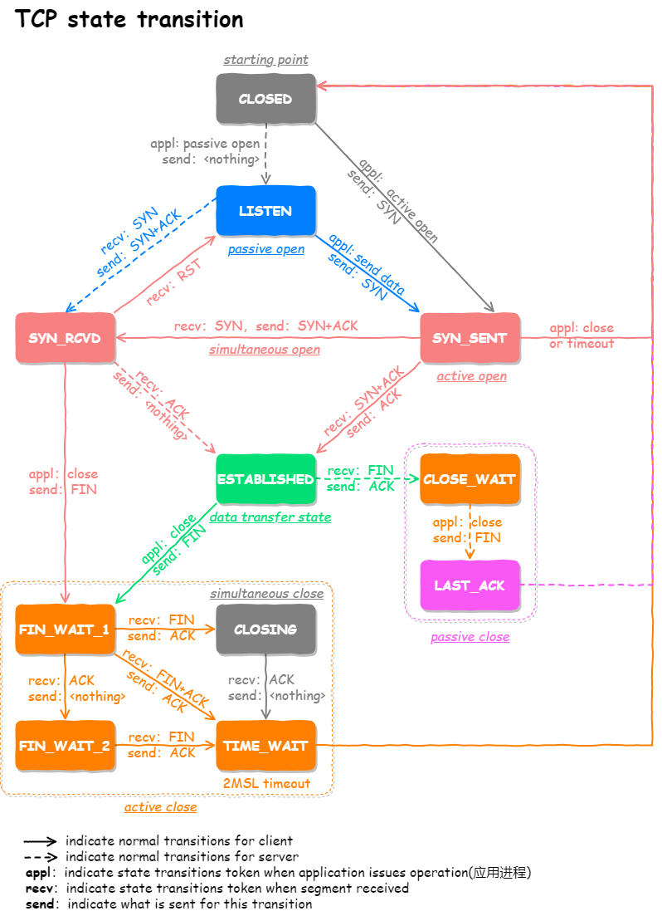

- **CLOSED：** 表示初始状态
- **LISTEN：** 表示服务器端的某个SOCKET处于监听状态，可以接受连接了
- **SYN_RCVD：** 表示接收到了SYN报文
- **SYN_SENT：** 表示客户端已发送SYN报文
- **ESTABLISHED：**表示连接已经建立了
- **TIME_WAIT：**表示收到了对方的FIN报文，并发送出了ACK报文，就等2MSL后即可回到CLOSED可用状态了
- **CLOSING：** 表示你发送FIN报文后，并没有收到对方的ACK报文，反而却也收到了对方的FIN报文。如果双方几乎在同时close一个SOCKET的话，那么就出现了双方同时发送FIN报 文的情况，也即会出现CLOSING状态，表示双方都正在关闭SOCKET连接
- **CLOSE_WAIT：** 表示在等待关闭


**如何在 Linux 系统中查看 TCP 状态？**

TCP 的连接状态查看，在 Linux 可以通过 `netstat -napt` 命令查看：


### TIME_WAIT 

**① 为什么需要 TIME_WAIT 状态？**

主动发起关闭连接的一方，才会有 `TIME-WAIT` 状态。需要 TIME-WAIT 状态，主要是两个原因：

- 防止具有相同「四元组」的「旧」数据包被收到
- 保证「被动关闭连接」的一方能被正确的关闭，即保证最后的 ACK 能让被动关闭方接收，从而帮助其正常关闭


**② TIME_WAIT 过多有什么危害？**

如果服务器有处于 TIME-WAIT 状态的 TCP，则说明是由服务器方主动发起的断开请求。过多的 TIME-WAIT 状态主要的危害有两种：

- 第一是内存资源占用
- 第二是对端口资源的占用，一个 TCP 连接至少消耗一个本地端口

第二个危害是会造成严重的后果的，要知道，端口资源也是有限的，一般可以开启的端口为 `32768～61000`，也可以通过如下参数设置指定

```shell
net.ipv4.ip_local_port_range
```

**如果发起连接一方的 TIME_WAIT 状态过多，占满了所有端口资源，则会导致无法创建新连接。**

客户端受端口资源限制：

- 客户端TIME_WAIT过多，就会导致端口资源被占用，因为端口就65536个，被占满就会导致无法创建新的连接

服务端受系统资源限制：

- 由于一个四元组表示 TCP 连接，理论上服务端可以建立很多连接，服务端确实只监听一个端口 但是会把连接扔给处理线程，所以理论上监听的端口可以继续监听。但是线程池处理不了那么多一直不断的连接了。所以当服务端出现大量 TIME_WAIT 时，系统资源被占满时，会导致处理不过来新的连接


**③ 如何优化 TIME_WAIT？**

这里给出优化 `TIME-WAIT` 的几个方式，都是有利有弊：

- 打开 `net.ipv4.tcp_tw_reuse` 和 `net.ipv4.tcp_timestamps` 选项
- `net.ipv4.tcp_max_tw_buckets`
- 程序中使用`SO_LINGER`，应用强制使用`RST`关闭


**④ 为什么 TIME_WAIT 等待的时间是 2MSL？**

`MSL` 是 Maximum Segment Lifetime，**报文最大生存时间**，它是任何报文在网络上存在的最长时间，超过这个时间报文将被丢弃。因为 TCP 报文基于是 IP 协议的，而 IP 头中有一个 `TTL` 字段，是 IP 数据报可以经过的最大路由数，每经过一个处理他的路由器此值就减 1，当此值为 0 则数据报将被丢弃，同时发送 ICMP 报文通知源主机。

**MSL 与 TTL 的区别**： MSL 的单位是时间，而 TTL 是经过路由跳数。所以 **MSL 应该要大于等于 TTL 消耗为 0 的时间**，以确保报文已被自然消亡。

TIME_WAIT 等待 2 倍的 MSL，比较合理的解释是： 网络中可能存在来自发送方的数据包，当这些发送方的数据包被接收方处理后又会向对方发送响应，所以**一来一回需要等待 2 倍的时间**。

比如如果被动关闭方没有收到断开连接的最后的 ACK 报文，就会触发超时重发 Fin 报文，另一方接收到 FIN 后，会重发 ACK 给被动关闭方， 一来一去正好 2 个 MSL。

`2MSL` 的时间是从**客户端接收到 FIN 后发送 ACK 开始计时的**。如果在 TIME-WAIT 时间内，因为客户端的 ACK 没有传输到服务端，客户端又接收到了服务端重发的 FIN 报文，那么 **2MSL 时间将重新计时**。

在 Linux 系统里 `2MSL` 默认是 `60` 秒，那么一个 `MSL` 也就是 `30` 秒。**Linux 系统停留在 TIME_WAIT 的时间为固定的 60 秒**。

其定义在 Linux 内核代码里的名称为 TCP_TIMEWAIT_LEN：

```shell
#define TCP_TIMEWAIT_LEN (60*HZ) /* how long to wait to destroy TIME-WAIT  state, about 60 seconds  */
```

如果要修改TIME_WAIT的时间长度，只能修改Linux内核代码里TCP_TIMEWAIT_LEN的值，并重新编译Linux内核。


## 连接过程

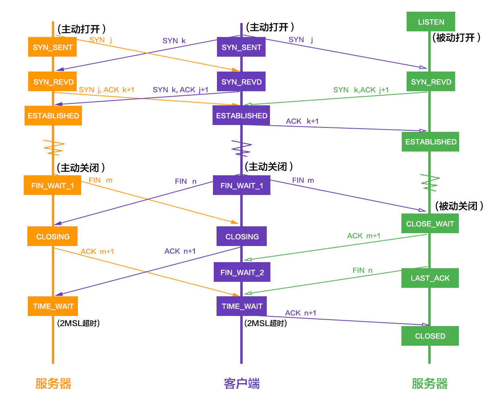

参考文档：https://www.cnblogs.com/jojop/p/14111160.html

### TCP三次握手

开始客户端和服务器都处于CLOSED状态，然后服务端开始监听某个端口，进入LISTEN状态：

- 第一次握手(SYN=1, seq=x)，发送完毕后，客户端进入 SYN_SENT 状态
- 第二次握手(SYN=1, ACK=1, seq=y, ACKnum=x+1)， 发送完毕后，服务器端进入 SYN_RCVD 状态
- 第三次握手(ACK=1，ACKnum=y+1)，发送完毕后，客户端进入 ESTABLISHED 状态，当服务器端接收到这个包时,也进入 ESTABLISHED 状态，TCP 握手，即可以开始数据传输


- 假设一开始客户端和服务端都处于`CLOSED`的状态。然后先是服务端主动监听某个端口，处于`LISTEN`状态

- 【第一个报文】：客户端会随机初始化序号（`client_isn`），将此序号置于 `TCP` 首部的「序号」字段中，同时把 `SYN` 标志位置为 `1` ，表示 `SYN` 报文。接着把第一个 SYN 报文发送给服务端，表示向服务端发起连接，该报文不包含应用层数据，之后客户端处于 `SYN-SENT` 状态

  

- 【第二个报文】：服务端收到客户端的 `SYN` 报文后，首先服务端也随机初始化自己的序号（`server_isn`），将此序号填入 TCP 首部的「序号」字段中，其次把 TCP 首部的「确认应答号」字段填入 `client_isn + 1`, 接着把 `SYN` 和 `ACK` 标志位置为 `1`。最后把该报文发给客户端，该报文也不包含应用层数据，之后服务端处于 `SYN-RCVD` 状态

  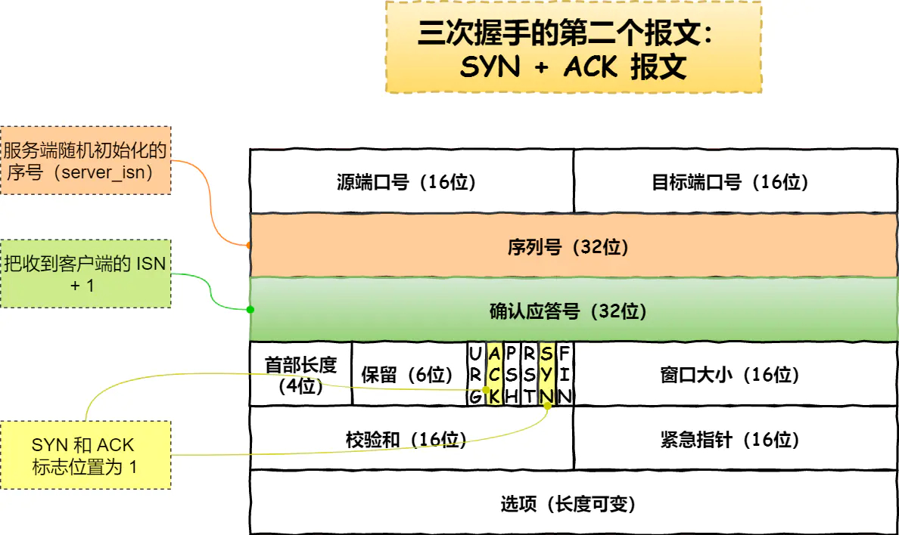

- 【第三个报文】：客户端收到服务端报文后，还要向服务端回应最后一个应答报文，首先该应答报文 TCP 首部 `ACK` 标志位置为 `1` ，其次「确认应答号」字段填入 `server_isn + 1` ，最后把报文发送给服务端，**这次报文可以携带客户到服务器的数据**，之后客户端处于 `ESTABLISHED` 状态

  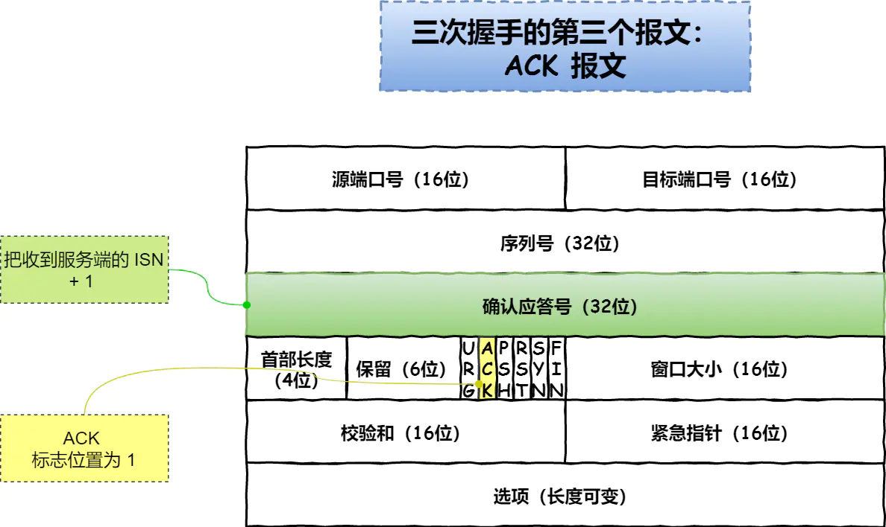

- 服务器收到客户端的应答报文后，也进入 `ESTABLISHED` 状态


**第三次握手是否可以携带数据?**

**第三次握手是可以携带数据的，前两次握手是不可以携带数据的**。一旦完成三次握手，双方都处于 `ESTABLISHED` 状态，此时连接就已建立完成，客户端和服务端就可以相互发送数据了。假设第三次握手的报文的`seq`是`x+1`：

- **如果有携带数据**：下次客户端发送的报文，`seq=服务器发回的ACK号`
- **如果没有携带数据**：第三次握手的报文不消耗`seq`，下次客户端发送的报文，`seq`序列号为`x+1`

**① 服务端SYN-RECV流程**

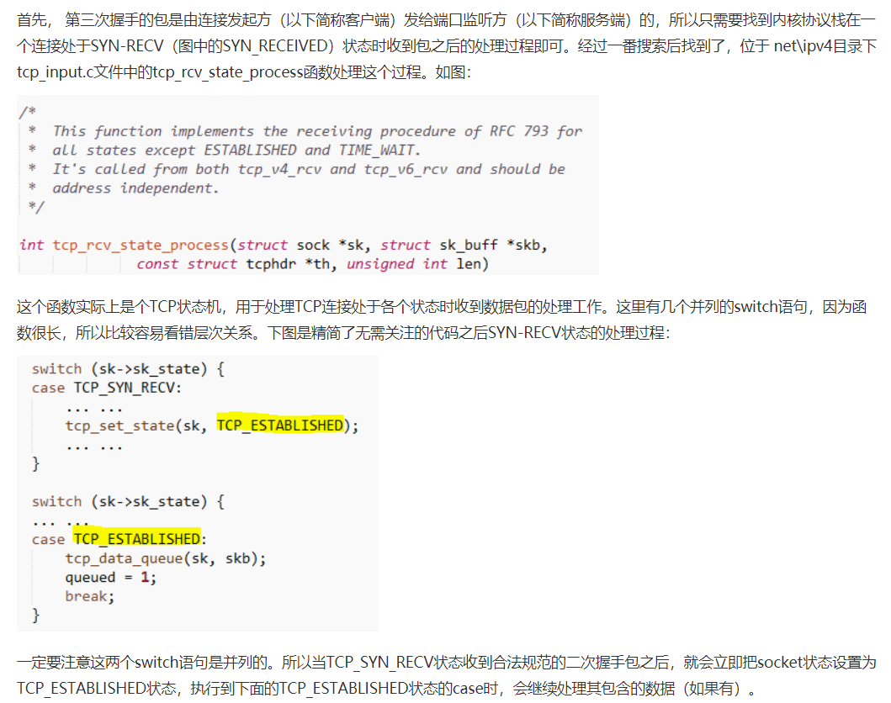

**② 客户端SYN-SEND流程**

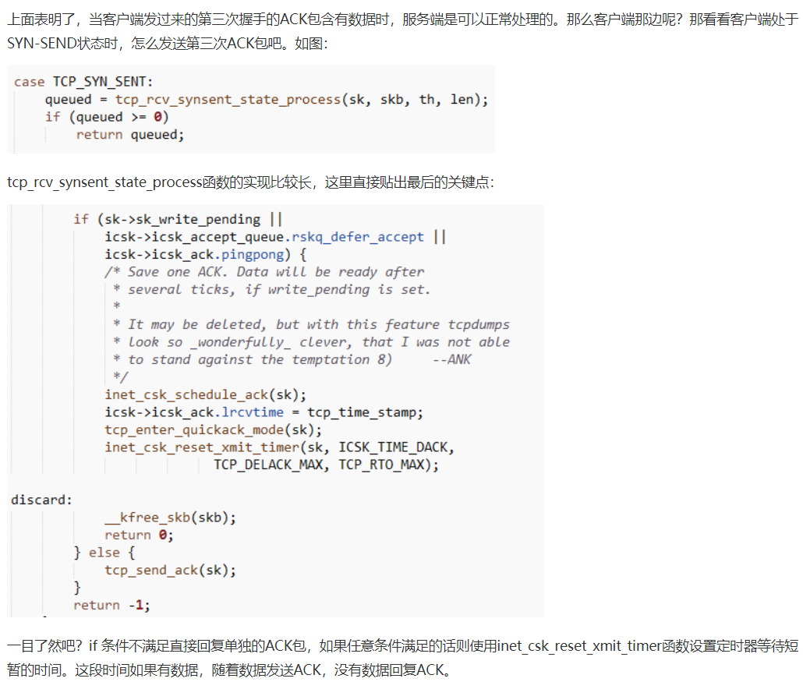

- **场景1：sk->sk_write_pending != 0**

  这个值默认是0的，那什么情况会导致不为0呢？答案是协议栈发送数据的函数遇到socket状态不是ESTABLISHED的时候，会对这个变量做++操作，并等待一小会时间尝试发送数据。

- **场景2：icsk->icsk_accept_queue.rskq_defer_accept != 0**

  客户端先bind到一个端口和IP，然后setsockopt(TCP_DEFER_ACCEPT），然后connect服务器，这个时候就会出现rskq_defer_accept=1的情况，这时候内核会设置定时器等待数据一起在回复ACK包。

- **场景3：icsk->icsk_ack.pingpong != 0**

  pingpong这个属性实际上也是一个套接字选项，用来表明当前链接是否为交互数据流，如其值为1，则表明为交互数据流，会使用延迟确认机制。


**为什么是三次握手？不是两次、四次？**

TCP建立连接时，通过三次握手**能防止历史连接的建立，能减少双方不必要的资源开销，能帮助双方同步初始化序列号**。序列号能够保证数据包不重复、不丢弃和按序传输。不使用「两次握手」和「四次握手」的原因：

- **两次握手**：无法防止历史连接的建立，会造成双方资源的浪费，也无法可靠的同步双方序列号
- **四次握手**：三次握手就已经理论上最少可靠连接建立，所以不需要使用更多的通信次数

接下来以三个方面分析三次握手的原因：

- 三次握手才可以阻止重复历史连接的初始化（主要原因）
- 三次握手才可以同步双方的初始序列号
- 三次握手才可以避免资源浪费

**原因一：避免历史连接**

客户端连续发送多次 SYN 建立连接的报文，在**网络拥堵**情况下：

- 一个「旧 SYN 报文」比「最新的 SYN 」 报文早到达了服务端
- 那么此时服务端就会回一个 `SYN + ACK` 报文给客户端
- 客户端收到后可以根据自身的上下文，判断这是一个历史连接（序列号过期或超时），那么客户端就会发送 `RST` 报文给服务端，表示中止这一次连接


如果是两次握手连接，就不能判断当前连接是否是历史连接，三次握手则可以在客户端（发送方）准备发送第三次报文时，客户端因有足够的上下文来判断当前连接是否是历史连接：

- 如果是历史连接（序列号过期或超时），则第三次握手发送的报文是 `RST` 报文，以此中止历史连接
- 如果不是历史连接，则第三次发送的报文是 `ACK` 报文，通信双方就会成功建立连接

所以，TCP 使用三次握手建立连接的最主要原因是**防止历史连接初始化了连接。**

**原因二：同步双方初始序列号**

TCP 协议的通信双方， 都必须维护一个「序列号」， 序列号是可靠传输的一个关键因素，它的作用：  

- 接收方可以去除重复的数据
- 接收方可以根据数据包的序列号按序接收
- 可以标识发送出去的数据包中， 哪些是已经被对方收到的

可见，序列号在 TCP 连接中占据着非常重要的作用，所以当客户端发送携带「初始序列号」的 `SYN` 报文的时候，需要服务端回一个 `ACK` 应答报文，表示客户端的 SYN 报文已被服务端成功接收，那当服务端发送「初始序列号」给客户端的时候，依然也要得到客户端的应答回应，**这样一来一回，才能确保双方的初始序列号能被可靠的同步。**


四次握手其实也能够可靠的同步双方的初始化序号，但由于**第二步和第三步可以优化成一步**，所以就成了「三次握手」。而两次握手只保证了一方的初始序列号能被对方成功接收，没办法保证双方的初始序列号都能被确认接收。

**原因三：避免资源浪费**

如果只有「两次握手」，当客户端的 `SYN` 请求连接在网络中阻塞，客户端没有接收到 `ACK` 报文，就会重新发送 `SYN` ，由于没有第三次握手，服务器不清楚客户端是否收到了自己发送的建立连接的 `ACK` 确认信号，所以每收到一个 `SYN` 就只能先主动建立一个连接，这会造成什么情况呢？如果客户端的 `SYN` 阻塞了，重复发送多次 `SYN` 报文，那么服务器在收到请求后就会**建立多个冗余的无效链接，造成不必要的资源浪费。**

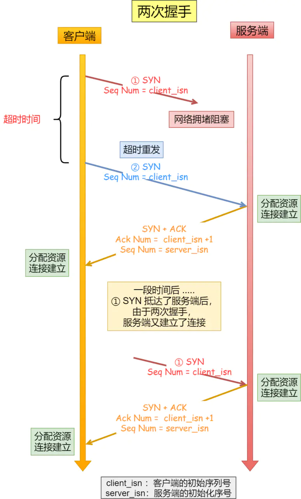

即两次握手会造成消息滞留情况下，服务器重复接受无用的连接请求 `SYN` 报文，而造成重复分配资源。


### TCP四次挥手

- 第一次挥手：**FIN=1，seq=u**，发送完毕后客户端进入**FIN_WAIT_1** 状态
- 第二次挥手：**ACK=1，seq =v，ack=u+1**，发送完毕后服务器端进入**CLOSE_WAIT** 状态，客户端接收到后进入 **FIN_WAIT_2** 状态
- 第三次挥手：**FIN=1，ACK=1，seq=w，ack=u+1**，发送完毕后服务器端进入**LAST_ACK**状态，客户端接收到后进入 **TIME_WAIT**状态
- 第四次挥手：**ACK=1，seq=u+1，ack=w+1**，客户端接收到来自服务器端的关闭请求，发送一个确认包，并进入 TIME_WAIT状态，等待了某个固定时间（两个最大段生命周期，**2MSL**，2 Maximum Segment Lifetime）之后，没有收到服务器端的 ACK ，认为服务器端已经正常关闭连接，于是自己也关闭连接，进入 CLOSED 状态。服务器端接收到这个确认包之后，关闭连接，进入 **CLOSED** 状态

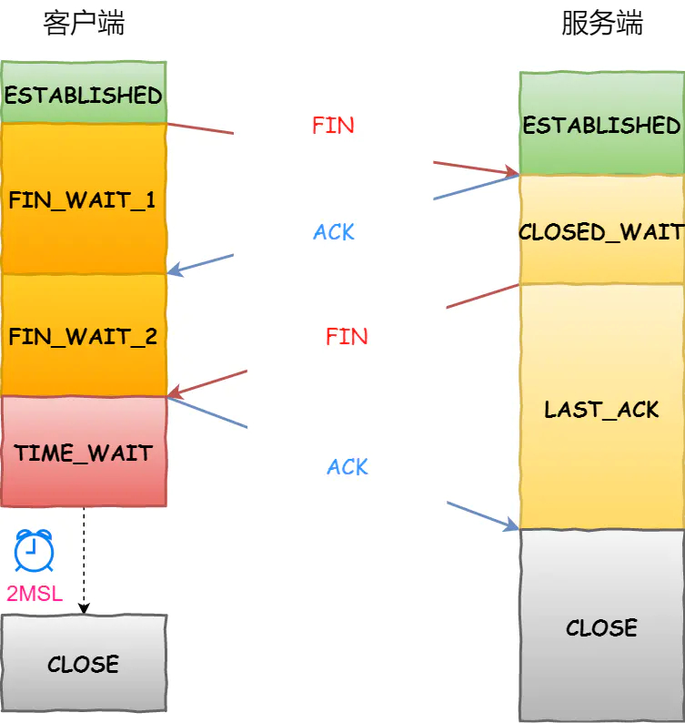

四次挥手过程：

- 客户端打算关闭连接，此时会发送一个 TCP 首部 `FIN` 标志位被置为 `1` 的报文，也即 `FIN` 报文，之后客户端进入 `FIN_WAIT_1` 状态
- 服务端收到该报文后，就向客户端发送 `ACK` 应答报文，接着服务端进入 `CLOSED_WAIT` 状态
- 客户端收到服务端的 `ACK` 应答报文后，之后进入 `FIN_WAIT_2` 状态
- 等待服务端处理完数据后，也向客户端发送 `FIN` 报文，之后服务端进入 `LAST_ACK` 状态
- 客户端收到服务端的 `FIN` 报文后，回一个 `ACK` 应答报文，之后进入 `TIME_WAIT` 状态
- 服务器收到了 `ACK` 应答报文后，就进入了 `CLOSE` 状态，至此服务端已经完成连接的关闭
- 客户端在经过 `2MSL` 一段时间后，自动进入 `CLOSE` 状态，至此客户端也完成连接的关闭


**为什么挥手需要四次？**

再来回顾下四次挥手双方发 `FIN` 包的过程，就能理解为什么需要四次了。

- 关闭连接时，客户端向服务端发送 `FIN` 时，仅仅表示客户端不再发送数据了但是还能接收数据。
- 服务器收到客户端的 `FIN` 报文时，先回一个 `ACK` 应答报文，而服务端可能还有数据需要处理和发送，等服务端不再发送数据时，才发送 `FIN` 报文给客户端来表示同意现在关闭连接。

从上面过程可知，服务端通常需要等待完成数据的发送和处理，所以服务端的 `ACK` 和 `FIN` 一般都会分开发送，从而比三次握手导致多了一次。


## TCP优化

正确有效的使用TCP参数可以提高 TCP 性能。以下将从三个角度来阐述提升 TCP 的策略，分别是：

### TCP三次握手优化

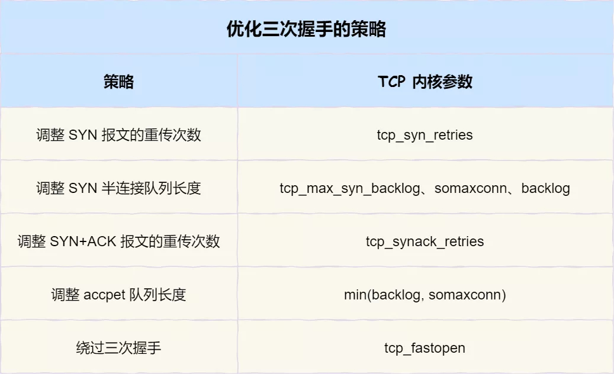


### TCP四次挥手优化

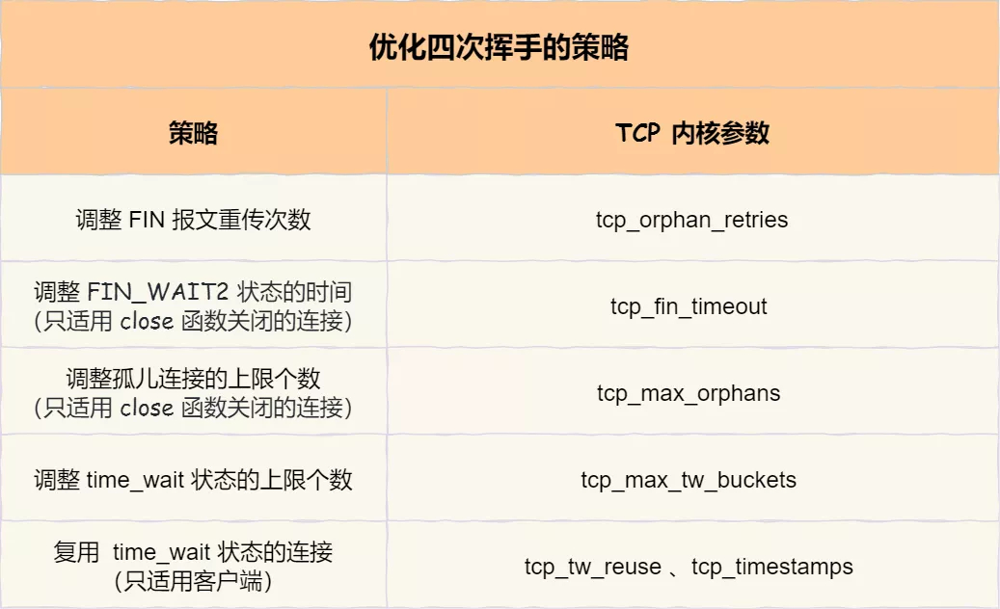


### TCP数据传输优化


## 常见问题

### TCP和UDP

**TCP和UDP的区别？**

- **连接**
  - TCP 是面向连接的传输层协议，传输数据前先要建立连接
  - UDP 是不需要连接，即刻传输数据

- **服务对象**
  - TCP 是一对一的两点服务，即一条连接只有两个端点
  - UDP 支持一对一、一对多、多对多的交互通信

- **可靠性**
  - TCP 是可靠交付数据的，数据可以无差错、不丢失、不重复、按需到达
  - UDP 是尽最大努力交付，不保证可靠交付数据

- **拥塞控制、流量控制**
  - TCP 有拥塞控制和流量控制机制，保证数据传输的安全性
  - UDP 则没有，即使网络非常拥堵了，也不会影响 UDP 的发送速率

- **首部开销**
  - TCP 首部长度较长，会有一定的开销，首部在没有使用「选项」字段时是 `20` 个字节，如果使用了「选项」字段则会变长的
  - UDP 首部只有 8 个字节，并且是固定不变的，开销较小

- **传输方式**
  - TCP 是流式传输，没有边界，但保证顺序和可靠
  - UDP 是一个包一个包的发送，是有边界的，但可能会丢包和乱序

- **分片不同**
  - TCP 的数据大小如果大于 MSS 大小，则会在传输层进行分片，目标主机收到后，也同样在传输层组装 TCP 数据包，如果中途丢失了一个分片，只需要传输丢失的这个分片
  - UDP 的数据大小如果大于 MTU 大小，则会在 IP 层进行分片，目标主机收到后，在 IP 层组装完数据，接着再传给传输层，但是如果中途丢了一个分片，则就需要重传所有的数据包，这样传输效率非常差，所以通常 UDP 的报文应该小于 MTU


### ISN

**① 为什么客户端和服务端的初始序列号 ISN 是不相同的？**

如果一个已经失效的连接被重用了，但是该旧连接的历史报文还残留在网络中，如果序列号相同，那么就无法分辨出该报文是不是历史报文，如果历史报文被新的连接接收了，则会产生数据错乱。所以，每次建立连接前重新初始化一个序列号主要是为了通信双方能够根据序号将不属于本连接的报文段丢弃。另一方面是为了安全性，防止黑客伪造的相同序列号的 TCP 报文被对方接收。


**② 初始序列号 ISN 是如何随机产生的？**

起始 `ISN` 是基于时钟的，每 4 毫秒 + 1，转一圈要 4.55 个小时。RFC1948 中提出了一个较好的初始化序列号 ISN 随机生成算法。

**ISN = M + F (localhost, localport, remotehost, remoteport)**

- `M` 是一个计时器，这个计时器每隔 4 毫秒加 1
- `F` 是一个 Hash 算法，根据源 IP、目的 IP、源端口、目的端口生成一个随机数值。要保证 Hash 算法不能被外部轻易推算得出，用 MD5 算法是一个比较好的选择


## Socket

基于TCP协议的客户端和服务器工作：


- 服务端和客户端初始化 `socket`，得到文件描述符
- 服务端调用 `bind`，将绑定在 IP 地址和端口
- 服务端调用 `listen`，进行监听
- 服务端调用 `accept`，等待客户端连接
- 客户端调用 `connect`，向服务器端的地址和端口发起连接请求
- 服务端 `accept` 返回用于传输的 `socket` 的文件描述符
- 客户端调用 `write` 写入数据；服务端调用 `read` 读取数据
- 客户端断开连接时，会调用 `close`，那么服务端 `read` 读取数据的时候，就会读取到了 `EOF`，待处理完数据后，服务端调用 `close`，表示连接关闭


> **listen 时候参数 backlog 的意义？**
>
> Linux内核中会维护两个队列：
>
> - 未完成连接队列（SYN 队列）：接收到一个 SYN 建立连接请求，处于 SYN_RCVD 状态；
> - 已完成连接队列（Accpet 队列）：已完成 TCP 三次握手过程，处于 ESTABLISHED 状态；
>
> 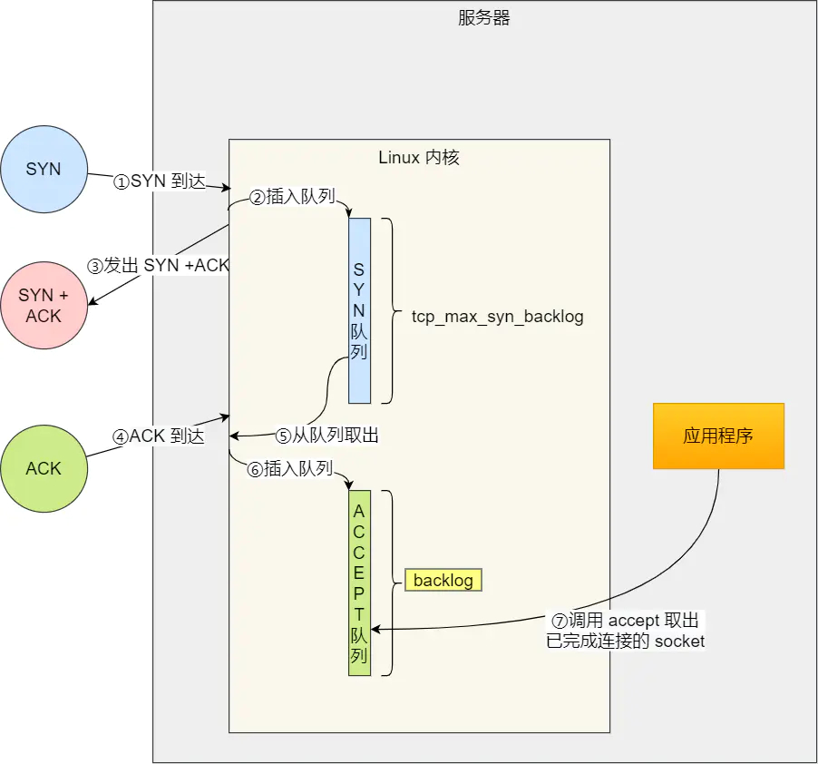 
>
> SYN 队列 与 Accpet 队列 
>
> ```shell
> int listen (int socketfd, int backlog)
> ```
>
> - 参数一 socketfd 为 socketfd 文件描述符
> - 参数二 backlog，这参数在历史内环版本有一定的变化
>
> 在早期Linux内核backlog是SYN队列大小，也就是未完成的队列大小。在Linux内核2.2之后，backlog变成accept队列，也就是已完成连接建立的队列长度，**所以现在通常认为backlog是accept队列**。但是上限值是内核参数somaxconn的大小，也就说accpet队列长度=min(backlog, somaxconn)。

> **accept 发送在三次握手的哪一步？**
>
> 我们先看看客户端连接服务端时，发送了什么？
>
> 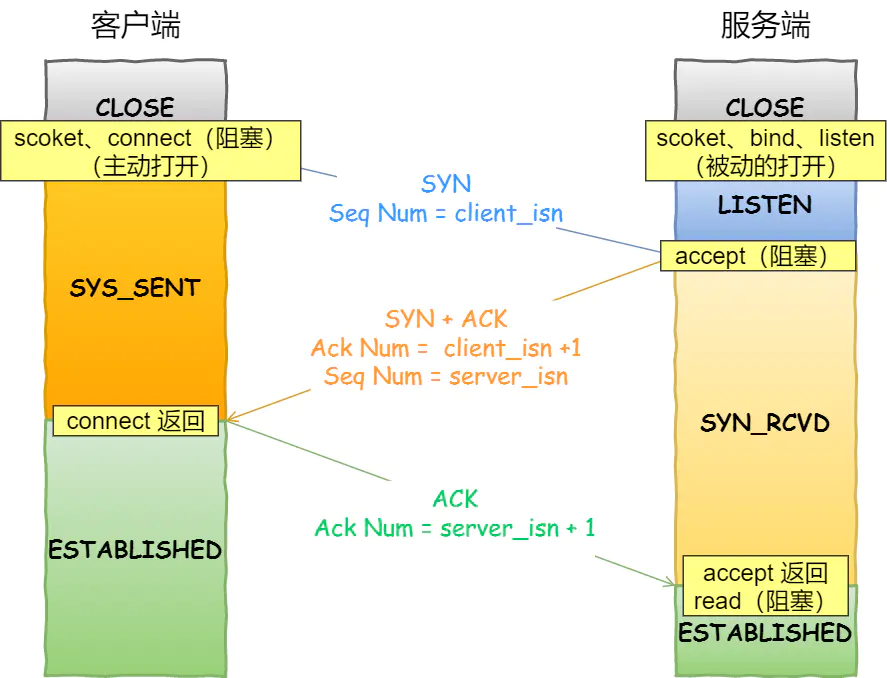
>
> - 客户端的协议栈向服务器端发送了 SYN 包，并告诉服务器端当前发送序列号 client_isn，客户端进入 SYNC_SENT 状态
> - 服务器端的协议栈收到这个包之后，和客户端进行 ACK 应答，应答的值为 client_isn+1，表示对 SYN 包 client_isn 的确认，同时服务器也发送一个 SYN 包，告诉客户端当前我的发送序列号为 server_isn，服务器端进入 SYNC_RCVD 状态
> - 客户端协议栈收到 ACK 之后，使得应用程序从 `connect` 调用返回，表示客户端到服务器端的单向连接建立成功，客户端的状态为 ESTABLISHED，同时客户端协议栈也会对服务器端的 SYN 包进行应答，应答数据为 server_isn+1
> - 应答包到达服务器端后，服务器端协议栈使得 `accept` 阻塞调用返回，这个时候服务器端到客户端的单向连接也建立成功，服务器端也进入 ESTABLISHED 状态
>
> 从上面的描述过程，我们可以得知**客户端 connect 成功返回是在第二次握手，服务端 accept 成功返回是在三次握手成功之后。**

> **客户端调用 close 了，连接是断开的流程是什么？**
>
> 我们看看客户端主动调用了 `close`，会发生什么？
>
> 
>
> - 客户端调用 `close`，表明客户端没有数据需要发送了，则此时会向服务端发送FIN报文，进入FIN_WAIT_1状态
> - 服务端接收到了 FIN 报文，TCP协议栈会为 FIN 包插入一个文件结束符 `EOF` 到接收缓冲区中，应用程序可以通过 `read` 调用来感知这个 FIN 包。这个 `EOF` 会被**放在已排队等候的其他已接收的数据之后**，这就意味着服务端需要处理这种异常情况，因为EOF表示在该连接上再无额外数据到达。此时服务端进入 CLOSE_WAIT 状态
> - 接着，当处理完数据后，自然就会读到 `EOF`，于是也调用 `close` 关闭它的套接字，这会使得会发出一个 FIN 包，之后处于 LAST_ACK 状态
> - 客户端接收到服务端的 FIN 包，并发送 ACK 确认包给服务端，此时客户端将进入 TIME_WAIT 状态
> - 服务端收到 ACK 确认包后，就进入了最后的 CLOSE 状态
> - 客户端进过 `2MSL` 时间之后，也进入 CLOSE 状态


## TCP源码

### tcp_v4_connect()

- 描述: 建立与服务器连接，发送SYN段

- 返回值: 0或错误码

- 代码关键路径:

  ```c
  int tcp_v4_connect(struct sock *sk, struct sockaddr *uaddr, int addr_len)
  {
      .....　     
      /* 设置目的地址和目标端口 */
      inet->dport = usin->sin_port;
      inet->daddr = daddr;
      ....     
      /* 初始化MSS上限 */
      tp->rx_opt.mss_clamp = 536;
  
      /* Socket identity is still unknown (sport may be zero).
       * However we set state to SYN-SENT and not releasing socket
       * lock select source port, enter ourselves into the hash tables and
       * complete initialization after this.
       */
      tcp_set_state(sk, TCP_SYN_SENT);/* 设置状态 */
      err = tcp_v4_hash_connect(sk);/* 将传输控制添加到ehash散列表中，并动态分配端口 */
      if (err)
          goto failure;
      ....
      if (!tp->write_seq)/* 还未计算初始序号 */
          /* 根据双方地址、端口计算初始序号 */
          tp->write_seq = secure_tcp_sequence_number(inet->saddr,
                                 inet->daddr,
                                 inet->sport,
                                 usin->sin_port);
  
      /* 根据初始序号和当前时间，随机算一个初始id */
      inet->id = tp->write_seq ^ jiffies;
  
      /* 发送SYN段 */
      err = tcp_connect(sk);
      rt = NULL;
      if (err)
          goto failure;
  
      return 0;
  }
  ```


### sys_accept()

- 描述: 调用tcp_accept(), 并把它返回的newsk进行连接描述符分配后返回给用户空间。

- 返回值: 连接描述符

- 代码关键路径:

  ```c
  asmlinkage long sys_accept(int fd, struct sockaddr __user *upeer_sockaddr, int __user *upeer_addrlen)
  {
      struct socket *sock, *newsock;
      .....     
      sock = sockfd_lookup(fd, &err);/* 获得侦听端口的socket */
      .....    
      if (!(newsock = sock_alloc()))/* 分配一个新的套接口，用来处理与客户端的连接 */ 
      .....     
      /* 调用传输层的accept，对TCP来说，是inet_accept */
      err = sock->ops->accept(sock, newsock, sock->file->f_flags);
      ....    
      if (upeer_sockaddr) {/* 调用者需要获取对方套接口地址和端口 */
          /* 调用传输层回调获得对方的地址和端口 */
          if(newsock->ops->getname(newsock, (struct sockaddr *)address, &len, 2)<0) {
          }
          /* 成功后复制到用户态 */
          err = move_addr_to_user(address, len, upeer_sockaddr, upeer_addrlen);
      }
      .....     
      if ((err = sock_map_fd(newsock)) < 0)/* 为新连接分配文件描述符 */
  
      return err;
  }
  ```


### tcp_accept()

**[注]**: 在内核2.6.32以后对应函数为inet_csk_accept().

- 描述: 通过在规定时间内，判断tcp_sock->accept_queue队列非空，代表有新的连接进入．

- 返回值: (struct sock *)newsk;

- 代码关键路径:

  ```c
  struct sock *tcp_accept(struct sock *sk, int flags, int *err)
  {
      ....
      /* Find already established connection */
      if (!tp->accept_queue) {/* accept队列为空，说明还没有收到新连接 */
          long timeo = sock_rcvtimeo(sk, flags & O_NONBLOCK);/* 如果套口是非阻塞的，或者在一定时间内没有新连接，则返回 */
  
          if (!timeo)/* 超时时间到，没有新连接，退出 */
              goto out;
  
          /* 运行到这里，说明有新连接到来，则等待新的传输控制块 */
          error = wait_for_connect(sk, timeo);
          if (error)
              goto out;
      }
  
      req = tp->accept_queue;
      if ((tp->accept_queue = req->dl_next) == NULL)
          tp->accept_queue_tail = NULL;
  
      newsk = req->sk;
      sk_acceptq_removed(sk);
      tcp_openreq_fastfree(req);
      ....
  
      return newsk;
  }
  ```

### 三次握手

#### 客户端发送SYN段

- 由tcp_v4_connect()->tcp_connect()->tcp_transmit_skb()发送，并置为TCP_SYN_SENT.

- 代码关键路径:

  ```c
  /* 构造并发送SYN段 */
  int tcp_connect(struct sock *sk)
  {
      struct tcp_sock *tp = tcp_sk(sk);
      struct sk_buff *buff;
  
      tcp_connect_init(sk);/* 初始化传输控制块中与连接相关的成员 */
  
      /* 为SYN段分配报文并进行初始化 */
      buff = alloc_skb(MAX_TCP_HEADER + 15, sk->sk_allocation);
      if (unlikely(buff == NULL))
          return -ENOBUFS;
  
      /* Reserve space for headers. */
      skb_reserve(buff, MAX_TCP_HEADER);
  
      TCP_SKB_CB(buff)->flags = TCPCB_FLAG_SYN;
      TCP_ECN_send_syn(sk, tp, buff);
      TCP_SKB_CB(buff)->sacked = 0;
      skb_shinfo(buff)->tso_segs = 1;
      skb_shinfo(buff)->tso_size = 0;
      buff->csum = 0;
      TCP_SKB_CB(buff)->seq = tp->write_seq++;
      TCP_SKB_CB(buff)->end_seq = tp->write_seq;
      tp->snd_nxt = tp->write_seq;
      tp->pushed_seq = tp->write_seq;
      tcp_ca_init(tp);
  
      /* Send it off. */
      TCP_SKB_CB(buff)->when = tcp_time_stamp;
      tp->retrans_stamp = TCP_SKB_CB(buff)->when;
  
      /* 将报文添加到发送队列上 */
      __skb_queue_tail(&sk->sk_write_queue, buff);
      sk_charge_skb(sk, buff);
      tp->packets_out += tcp_skb_pcount(buff);
      /* 发送SYN段 */
      tcp_transmit_skb(sk, skb_clone(buff, GFP_KERNEL));
      TCP_INC_STATS(TCP_MIB_ACTIVEOPENS);
  
      /* Timer for repeating the SYN until an answer. */
      /* 启动重传定时器 */
      tcp_reset_xmit_timer(sk, TCP_TIME_RETRANS, tp->rto);
      return 0;
  }
  ```


#### 服务端发送SYN和ACK处理

服务端接收到SYN段后，发送SYN/ACK处理：

- 由tcp_v4_do_rcv()->tcp_rcv_state_process()->tcp_v4_conn_request()->tcp_v4_send_synack().

- tcp_v4_send_synack()

  - tcp_make_synack(sk, dst, req);  ** 根据路由、传输控制块、连接请求块中的构建SYN+ACK段 **

  - ip_build_and_send_pkt(); * 生成IP数据报并发送出去 *


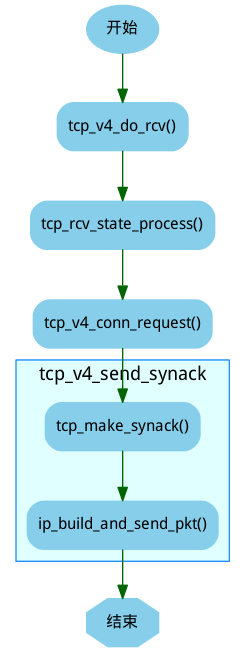

  - 代码关键路径:

    ```c
    /* 向客户端发送SYN+ACK报文 */
    static int tcp_v4_send_synack(struct sock *sk, struct open_request *req,
                      struct dst_entry *dst)
    {
        int err = -1;
        struct sk_buff * skb;
    
        /* First, grab a route. */
        /* 查找到客户端的路由 */
        if (!dst && (dst = tcp_v4_route_req(sk, req)) == NULL)
            goto out;
    
        /* 根据路由、传输控制块、连接请求块中的构建SYN+ACK段 */
        skb = tcp_make_synack(sk, dst, req);
    
        if (skb) {/* 生成SYN+ACK段成功 */
            struct tcphdr *th = skb->h.th;
    
            /* 生成校验码 */
            th->check = tcp_v4_check(th, skb->len,
                         req->af.v4_req.loc_addr,
                         req->af.v4_req.rmt_addr,
                         csum_partial((char *)th, skb->len,
                                  skb->csum));
    
            /* 生成IP数据报并发送出去 */
            err = ip_build_and_send_pkt(skb, sk, req->af.v4_req.loc_addr,
                            req->af.v4_req.rmt_addr,
                            req->af.v4_req.opt);
            if (err == NET_XMIT_CN)
                err = 0;
        }
    
    out:
        dst_release(dst);
        return err;
    }
    ```


#### 客户端回复确认ACK段

- 由tcp_v4_do_rcv()->tcp_rcv_state_process().当前客户端处于TCP_SYN_SENT状态。

- tcp_rcv_synsent_state_process(); \* tcp_rcv_synsent_state_process处理SYN_SENT状态下接收到的TCP段 *

  - tcp_ack(); ** 处理接收到的ack报文 **

  - tcp_send_ack(); * 在主动连接时，向服务器端发送ACK完成连接，并更新窗口 *

    - alloc_skb(); ** 构造ack段 **
    - tcp_transmit_skb(); ** 将ack段发出 **
    
  - tcp_urg(sk, skb, th); ** 处理完第二次握手后，还需要处理带外数据 **
  
  - tcp_data_snd_check(sk); \* 检测是否有数据需要发送 *
  
    - 检查sk->sk_send_head队列上是否有待发送的数据。
  - tcp_write_xmit(); ** 将TCP发送队列上的段发送出去 **
  
- 代码关键路径:

```c
/* 在SYN_SENT状态下处理接收到的段，但是不处理带外数据 */
static int tcp_rcv_synsent_state_process(struct sock *sk, struct sk_buff *skb,
                   struct tcphdr *th, unsigned len)
{
  struct tcp_sock *tp = tcp_sk(sk);
  int saved_clamp = tp->rx_opt.mss_clamp;

  /* 解析TCP选项并保存到传输控制块中 */
  tcp_parse_options(skb, &tp->rx_opt, 0);

  if (th->ack) {/* 处理ACK标志 */
      /* rfc793:
       * "If the state is SYN-SENT then
       *    first check the ACK bit
       *      If the ACK bit is set
       *    If SEG.ACK =< ISS, or SEG.ACK > SND.NXT, send
       *        a reset (unless the RST bit is set, if so drop
       *        the segment and return)"
       *
       *  We do not send data with SYN, so that RFC-correct
       *  test reduces to:
       */
      if (TCP_SKB_CB(skb)->ack_seq != tp->snd_nxt)
          goto reset_and_undo;

      if (tp->rx_opt.saw_tstamp && tp->rx_opt.rcv_tsecr &&
          !between(tp->rx_opt.rcv_tsecr, tp->retrans_stamp,
               tcp_time_stamp)) {
          NET_INC_STATS_BH(LINUX_MIB_PAWSACTIVEREJECTED);
          goto reset_and_undo;
      }

      /* Now ACK is acceptable.
       *
       * "If the RST bit is set
       *    If the ACK was acceptable then signal the user "error:
       *    connection reset", drop the segment, enter CLOSED state,
       *    delete TCB, and return."
       */

      if (th->rst) {/* 收到ACK+RST段，需要tcp_reset设置错误码，并关闭套接口 */
          tcp_reset(sk);
          goto discard;
      }

      /* rfc793:
       *   "fifth, if neither of the SYN or RST bits is set then
       *    drop the segment and return."
       *
       *    See note below!
       *                                        --ANK(990513)
       */
      if (!th->syn)/* 在SYN_SENT状态下接收到的段必须存在SYN标志，否则说明接收到的段无效，丢弃该段 */
          goto discard_and_undo;

      /* rfc793:
       *   "If the SYN bit is on ...
       *    are acceptable then ...
       *    (our SYN has been ACKed), change the connection
       *    state to ESTABLISHED..."
       */

      /* 从首部标志中获取显示拥塞通知的特性 */
      TCP_ECN_rcv_synack(tp, th);
      if (tp->ecn_flags&TCP_ECN_OK)/* 如果支持ECN，则设置标志 */
          sk->sk_no_largesend = 1;

      /* 设置与窗口相关的成员变量 */
      tp->snd_wl1 = TCP_SKB_CB(skb)->seq;
      tcp_ack(sk, skb, FLAG_SLOWPATH);

      /* Ok.. it's good. Set up sequence numbers and
       * move to established.
       */
      tp->rcv_nxt = TCP_SKB_CB(skb)->seq + 1;
      tp->rcv_wup = TCP_SKB_CB(skb)->seq + 1;

      /* RFC1323: The window in SYN & SYN/ACK segments is
       * never scaled.
       */
      tp->snd_wnd = ntohs(th->window);
      tcp_init_wl(tp, TCP_SKB_CB(skb)->ack_seq, TCP_SKB_CB(skb)->seq);

      if (!tp->rx_opt.wscale_ok) {
          tp->rx_opt.snd_wscale = tp->rx_opt.rcv_wscale = 0;
          tp->window_clamp = min(tp->window_clamp, 65535U);
      }

      if (tp->rx_opt.saw_tstamp) {/* 根据是否支持时间戳选项来设置传输控制块的相关字段 */
          tp->rx_opt.tstamp_ok       = 1;
          tp->tcp_header_len =
              sizeof(struct tcphdr) + TCPOLEN_TSTAMP_ALIGNED;
          tp->advmss      -= TCPOLEN_TSTAMP_ALIGNED;
          tcp_store_ts_recent(tp);
      } else {
          tp->tcp_header_len = sizeof(struct tcphdr);
      }

      /* 初始化PMTU、MSS等成员变量 */
      if (tp->rx_opt.sack_ok && sysctl_tcp_fack)
          tp->rx_opt.sack_ok |= 2;

      tcp_sync_mss(sk, tp->pmtu_cookie);
      tcp_initialize_rcv_mss(sk);

      /* Remember, tcp_poll() does not lock socket!
       * Change state from SYN-SENT only after copied_seq
       * is initialized. */
      tp->copied_seq = tp->rcv_nxt;
      mb();
      tcp_set_state(sk, TCP_ESTABLISHED);

      /* Make sure socket is routed, for correct metrics.  */
      tp->af_specific->rebuild_header(sk);

      tcp_init_metrics(sk);

      /* Prevent spurious tcp_cwnd_restart() on first data
       * packet.
       */
      tp->lsndtime = tcp_time_stamp;

      tcp_init_buffer_space(sk);

      /* 如果启用了连接保活，则启用连接保活定时器 */
      if (sock_flag(sk, SOCK_KEEPOPEN))
          tcp_reset_keepalive_timer(sk, keepalive_time_when(tp));

      if (!tp->rx_opt.snd_wscale)/* 首部预测 */
          __tcp_fast_path_on(tp, tp->snd_wnd);
      else
          tp->pred_flags = 0;

      if (!sock_flag(sk, SOCK_DEAD)) {/* 如果套口不处于SOCK_DEAD状态，则唤醒等待该套接口的进程 */
          sk->sk_state_change(sk);
          sk_wake_async(sk, 0, POLL_OUT);
      }

      /* 连接建立完成，根据情况进入延时确认模式 */
      if (sk->sk_write_pending || tp->defer_accept || tp->ack.pingpong) {
          /* Save one ACK. Data will be ready after
           * several ticks, if write_pending is set.
           *
           * It may be deleted, but with this feature tcpdumps
           * look so _wonderfully_ clever, that I was not able
           * to stand against the temptation 8)     --ANK
           */
          tcp_schedule_ack(tp);
          tp->ack.lrcvtime = tcp_time_stamp;
          tp->ack.ato  = TCP_ATO_MIN;
          tcp_incr_quickack(tp);
          tcp_enter_quickack_mode(tp);
          tcp_reset_xmit_timer(sk, TCP_TIME_DACK, TCP_DELACK_MAX);

discard:
          __kfree_skb(skb);
          return 0;
      } else {/* 不需要延时确认，立即发送ACK段 */
          tcp_send_ack(sk);
      }
      return -1;
  }

  /* No ACK in the segment */

  if (th->rst) {/* 收到RST段，则丢弃传输控制块 */
      /* rfc793:
       * "If the RST bit is set
       *
       *      Otherwise (no ACK) drop the segment and return."
       */

      goto discard_and_undo;
  }

  /* PAWS check. */
  /* PAWS检测失效，也丢弃传输控制块 */
  if (tp->rx_opt.ts_recent_stamp && tp->rx_opt.saw_tstamp && tcp_paws_check(&tp->rx_opt, 0))
      goto discard_and_undo;

  /* 在SYN_SENT状态下收到了SYN段并且没有ACK，说明是两端同时打开 */
  if (th->syn) {
      /* We see SYN without ACK. It is attempt of
       * simultaneous connect with crossed SYNs.
       * Particularly, it can be connect to self.
       */
      tcp_set_state(sk, TCP_SYN_RECV);/* 设置状态为TCP_SYN_RECV */

      if (tp->rx_opt.saw_tstamp) {/* 设置时间戳相关的字段 */
          tp->rx_opt.tstamp_ok = 1;
          tcp_store_ts_recent(tp);
          tp->tcp_header_len =
              sizeof(struct tcphdr) + TCPOLEN_TSTAMP_ALIGNED;
      } else {
          tp->tcp_header_len = sizeof(struct tcphdr);
      }

      /* 初始化窗口相关的成员变量 */
      tp->rcv_nxt = TCP_SKB_CB(skb)->seq + 1;
      tp->rcv_wup = TCP_SKB_CB(skb)->seq + 1;

      /* RFC1323: The window in SYN & SYN/ACK segments is
       * never scaled.
       */
      tp->snd_wnd    = ntohs(th->window);
      tp->snd_wl1    = TCP_SKB_CB(skb)->seq;
      tp->max_window = tp->snd_wnd;

      TCP_ECN_rcv_syn(tp, th);/* 从首部标志中获取显式拥塞通知的特性。 */
      if (tp->ecn_flags&TCP_ECN_OK)
          sk->sk_no_largesend = 1;

      /* 初始化MSS相关的成员变量 */
      tcp_sync_mss(sk, tp->pmtu_cookie);
      tcp_initialize_rcv_mss(sk);

      /* 向对端发送SYN+ACK段，并丢弃接收到的SYN段 */
      tcp_send_synack(sk);
#if 0
      /* Note, we could accept data and URG from this segment.
       * There are no obstacles to make this.
       *
       * However, if we ignore data in ACKless segments sometimes,
       * we have no reasons to accept it sometimes.
       * Also, seems the code doing it in step6 of tcp_rcv_state_process
       * is not flawless. So, discard packet for sanity.
       * Uncomment this return to process the data.
       */
      return -1;
#else
      goto discard;
#endif
  }
  /* "fifth, if neither of the SYN or RST bits is set then
   * drop the segment and return."
   */

discard_and_undo:
  tcp_clear_options(&tp->rx_opt);
  tp->rx_opt.mss_clamp = saved_clamp;
  goto discard;

reset_and_undo:
  tcp_clear_options(&tp->rx_opt);
  tp->rx_opt.mss_clamp = saved_clamp;
  return 1;
}
```


#### 服务端收到ACK段

- 由tcp_v4_do_rcv()->tcp_rcv_state_process().当前服务端处于TCP_SYN_RECV状态变为TCP_ESTABLISHED状态。

- 代码关键路径:

  ```c
  /* 除了ESTABLISHED和TIME_WAIT状态外，其他状态下的TCP段处理都由本函数实现 */ 
  int tcp_rcv_state_process(struct sock *sk, struct sk_buff *skb,
                struct tcphdr *th, unsigned len)
  {
      struct tcp_sock *tp = tcp_sk(sk);
      int queued = 0;
  
      tp->rx_opt.saw_tstamp = 0;
  
      switch (sk->sk_state) {
      .....
      /* SYN_RECV状态的处理 */
      if (tcp_fast_parse_options(skb, th, tp) && tp->rx_opt.saw_tstamp &&/* 解析TCP选项，如果首部中存在时间戳选项 */
          tcp_paws_discard(tp, skb)) {/* PAWS检测失败，则丢弃报文 */
          if (!th->rst) {/* 如果不是RST段 */
              /* 发送DACK给对端，说明接收到的TCP段已经处理过 */
              NET_INC_STATS_BH(LINUX_MIB_PAWSESTABREJECTED);
              tcp_send_dupack(sk, skb);
              goto discard;
          }
          /* Reset is accepted even if it did not pass PAWS. */
      }
  
      /* step 1: check sequence number */
      if (!tcp_sequence(tp, TCP_SKB_CB(skb)->seq, TCP_SKB_CB(skb)->end_seq)) {/* TCP段序号无效 */
          if (!th->rst)/* 如果TCP段无RST标志，则发送DACK给对方 */
              tcp_send_dupack(sk, skb);
          goto discard;
      }
  
      /* step 2: check RST bit */
      if(th->rst) {/* 如果有RST标志，则重置连接 */
          tcp_reset(sk);
          goto discard;
      }
  
      /* 如果有必要，则更新时间戳 */
      tcp_replace_ts_recent(tp, TCP_SKB_CB(skb)->seq);
  
      /* step 3: check security and precedence [ignored] */
  
      /*  step 4:
       *
       *  Check for a SYN in window.
       */
      if (th->syn && !before(TCP_SKB_CB(skb)->seq, tp->rcv_nxt)) {/* 如果有SYN标志并且序号在接收窗口内 */
          NET_INC_STATS_BH(LINUX_MIB_TCPABORTONSYN);
          tcp_reset(sk);/* 复位连接 */
          return 1;
      }
  
      /* step 5: check the ACK field */
      if (th->ack) {/* 如果有ACK标志 */
          /* 检查ACK是否为正常的第三次握手 */
          int acceptable = tcp_ack(sk, skb, FLAG_SLOWPATH);
  
          switch(sk->sk_state) {
          case TCP_SYN_RECV:
              if (acceptable) {
                  tp->copied_seq = tp->rcv_nxt;
                  mb();
                  /* 正常的第三次握手，设置连接状态为TCP_ESTABLISHED */
                  tcp_set_state(sk, TCP_ESTABLISHED);
                  sk->sk_state_change(sk);
  
                  /* Note, that this wakeup is only for marginal
                   * crossed SYN case. Passively open sockets
                   * are not waked up, because sk->sk_sleep ==
                   * NULL and sk->sk_socket == NULL.
                   */
                  if (sk->sk_socket) {/* 状态已经正常，唤醒那些等待的线程 */
                      sk_wake_async(sk,0,POLL_OUT);
                  }
  
                  /* 初始化传输控制块，如果存在时间戳选项，同时平滑RTT为0，则需计算重传超时时间 */
                  tp->snd_una = TCP_SKB_CB(skb)->ack_seq;
                  tp->snd_wnd = ntohs(th->window) <<
                            tp->rx_opt.snd_wscale;
                  tcp_init_wl(tp, TCP_SKB_CB(skb)->ack_seq,
                          TCP_SKB_CB(skb)->seq);
  
                  /* tcp_ack considers this ACK as duplicate
                   * and does not calculate rtt.
                   * Fix it at least with timestamps.
                   */
                  if (tp->rx_opt.saw_tstamp && tp->rx_opt.rcv_tsecr &&
                      !tp->srtt)
                      tcp_ack_saw_tstamp(tp, 0);
  
                  if (tp->rx_opt.tstamp_ok)
                      tp->advmss -= TCPOLEN_TSTAMP_ALIGNED;
  
                  /* Make sure socket is routed, for
                   * correct metrics.
                   */
                  /* 建立路由，初始化拥塞控制模块 */
                  tp->af_specific->rebuild_header(sk);
  
                  tcp_init_metrics(sk);
  
                  /* Prevent spurious tcp_cwnd_restart() on
                   * first data packet.
                   */
                  tp->lsndtime = tcp_time_stamp;/* 更新最近一次发送数据包的时间 */
  
                  tcp_initialize_rcv_mss(sk);
                  tcp_init_buffer_space(sk);
                  tcp_fast_path_on(tp);/* 计算有关TCP首部预测的标志 */
              } else {
                  return 1;
              }
              break;
          .....
          }
      } else
          goto discard;
      .....
  
      /* step 6: check the URG bit */
      tcp_urg(sk, skb, th);/* 检测带外数据位 */
  
      /* tcp_data could move socket to TIME-WAIT */
      if (sk->sk_state != TCP_CLOSE) {/* 如果tcp_data需要发送数据和ACK则在这里处理 */
          tcp_data_snd_check(sk);
          tcp_ack_snd_check(sk);
      }
  
      if (!queued) { /* 如果段没有加入队列，或者前面的流程需要释放报文，则释放它 */
  discard:
          __kfree_skb(skb);
      }
      return 0;
  }
  ```


# HTTP

https://juejin.cn/post/6844903789078675469#heading-23

## HTTP缓存

**HTTP 缓存的好处？**

- 减少亢余的数据传输，节约资源
- 缓解服务器压力，提高网站性能
- 加快客户加载网页的速度


**不想使用缓存的几种方式**

- Ctrl + F5强制刷新，都会直接向服务器提取数据
- 按F5刷新或浏览器的刷新按钮，默认加上Cache-Control：max-age=0，即会走协商缓存


**浏览器的缓存分类**

- 强缓存 200 (from memory cache)和200 (from disk cache)
- 协商缓存 304 (Not Modified)


**刷新操作的缓存策略**

- 正常操作：强制缓存有效，协商缓存有效
- 手动刷新：强制缓存失效，协商缓存有效
- 强制刷新：强制缓存失效，协商缓存失效


### 缓存流程

强制缓存优先于协商缓存进行，若强制缓存(Expires和Cache-Control)生效则直接使用缓存，若不生效则进行协商缓存(Last-Modified / If-Modified-Since和Etag / If-None-Match)，协商缓存由服务器决定是否使用缓存，若协商缓存失效，那么代表该请求的缓存失效，重新获取请求结果，再存入浏览器缓存中；生效则返回304，继续使用缓存，主要过程如下：


### 强制缓存

如果启用了强缓存，请求资源时不会向服务器发送请求，直接从缓存中读取资源，在chrome控制台的network中看到请求返回的200状态码，并在状态码的后面跟着from disk cache 或者from memory cache关键字。两者的差别在于获取缓存的位置不一样。

- **Pragma**：在 http1.1 中被遗弃
- **Cache-Control**：http1.1 时出现的header信息。设置过期时间（绝对时间、时间点），超过了这个时间点就代表资源过期。但是用户的本地时间是可以自行调整的，所以会出现问题。
  - **max-age=x(单位秒)**：缓存内容将在x秒后失效，如 `Cache-Control:max-age=36000`
  - **no-cache**：客户端缓存内容，但是是否使用缓存则需要经过协商缓存来验证决定
  - **no-store**：所有内容都不会被缓存，即不使用强制缓存，也不使用协商缓存
  - **private**：所有内容只有客户端可以缓存，**Cache-Control的默认取值**
  - **public**：所有内容都将被缓存（客户端和代理服务器都可缓存）
- **Expires**：是http1.0的规范，它的值是一个绝对时间的GMT格式的时间字符串。设置过期时长（相对时间、时间段），指定一个时间长度，跟本地时间无关，在这个时间段内缓存是有效的。
  - 同在Response Headers中
  - 同为控制缓存过期
  - 已被Cache-Control代替

**注意**：生效优先级为（从高到低）：**Pragma > Cache-Control > Expires** 。


#### Pragma

在 http1.1 中被遗弃。


#### Cache-Control


**第一步**：浏览器首次发起请求，缓存为空，服务器响应：


浏览器缓存此响应，缓存寿命为接收到此响应开始计时 100s 。

**第二步**：10s 过后，浏览器再次发起请求，检测缓存未过期，浏览器计算 Age: 10 ，然后直接使用缓存，这里是直接去内存中的缓存，from disk 是取磁盘上的缓存：

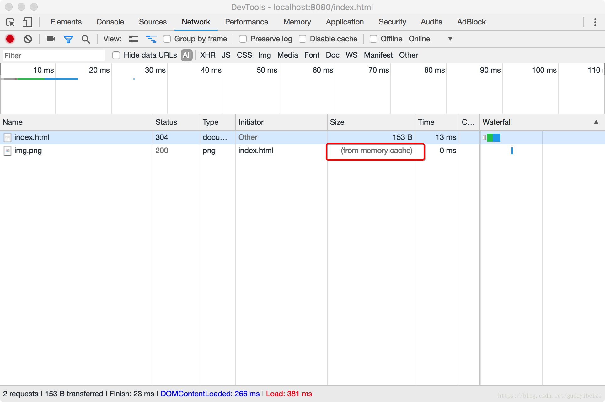

**第三步**：100s 过后，浏览器再次发起请求，检测缓存过期，向服务器发起验证缓存请求。如果服务器对比文件已发生改变，则如 1；否则不返回文件数据报文，直接返回 304：

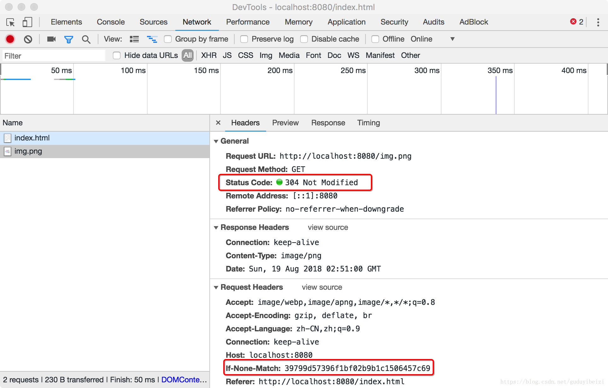


#### Expires

Expires是HTTP/1.0控制网页缓存的字段，其值为服务器返回该请求的结果缓存的到期时间，即再次发送请求时，如果客户端的时间小于Expires的值时，直接使用缓存结果。

Expires是HTTP/1.0的字段，但是现在浏览器的默认使用的是HTTP/1.1，那么在HTTP/1.1中网页缓存还是否由Expires控制？到了HTTP/1.1，Expires已经被Cache-Control替代，原因在于Expires控制缓存的原理是使用**客户端的时间**与**服务端返回的时间**做对比，如果客户端与服务端的时间由于某些原因（时区不同；客户端和服务端有一方的时间不准确）发生误差，那么强制缓存直接失效，那么强制缓存存在的意义就毫无意义。


### 协商缓存

协商缓存（对比缓存）就是由服务器来确定缓存资源是否可用，所以客户端与服务器端要通过某种标识来进行通信，从而让服务器判断请求资源是否可以缓存访问，这主要涉及到下面两组header字段。这两组搭档都是成对出现的，即第一次请求的响应头带上某个字段（Last-Modified或者Etag），则后续请求则会带上对应的请求字段（If-Modified-Since或者If-None-Match），若响应头没有Last-Modified或者Etag字段，则请求头也不会有对应的字段。

**注意**：Last-Modified与ETag是可以一起使用的，服务器会优先验证ETag，一致的情况下，才会继续比对Last-Modified，最后才决定是否返回304。


#### ETag/If-None-Match


**Etag**

Etag是服务器响应请求时，返回当前资源文件的一个唯一标识(由服务器生成)，如下：

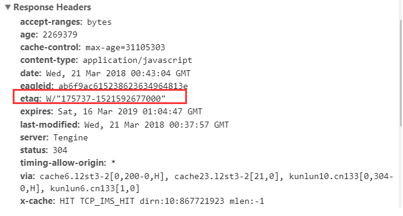

**If-None-Match**

If-None-Match是客户端再次发起该请求时，携带上次请求返回的唯一标识Etag值，通过此字段值告诉服务器该资源上次请求返回的唯一标识值。服务器收到该请求后，发现该请求头中含有If-None-Match，则会根据If-None-Match的字段值与该资源在服务器的Etag值做对比，一致则返回304，代表资源无更新，继续使用缓存文件；不一致则重新返回资源文件，状态码为200，如下：


**注意**：Etag/If-None-Match优先级高于Last-Modified/If-Modified-Since，同时存在则只有Etag/If-None-Match生效。


#### Last-Modified/If-Modified-Since


**Last-Modified**

Last-Modified是服务器响应请求时，返回该资源文件在服务器最后被修改的时间，如下：


**If-Modified-Since**

If-Modified-Since则是客户端再次发起该请求时，携带上次请求返回的Last-Modified值，通过此字段值告诉服务器该资源上次请求返回的最后被修改时间。服务器收到该请求，发现请求头含有If-Modified-Since字段，则会根据If-Modified-Since的字段值与该资源在服务器的最后被修改时间做对比，若服务器的资源最后被修改时间大于If-Modified-Since的字段值，则重新返回资源，状态码为200；否则则返回304，代表资源无更新，可继续使用缓存文件，如下：


 

**常见问题**

**问题一：为什么要有Etag？**

你可能会觉得使用Last-Modified已经足以让浏览器知道本地的缓存副本是否足够新，为什么还需要Etag呢？HTTP1.1中Etag的出现主要是为了解决几个Last-Modified比较难解决的问题：

> 一些文件也许会周期性的更改，但是他的内容并不改变(仅仅改变的修改时间)，这个时候我们并不希望客户端认为这个文件被修改了，而重新GET；
> 某些文件修改非常频繁，比如在秒以下的时间内进行修改，(比方说1s内修改了N次)，If-Modified-Since能检查到的粒度是s级的，这种修改无法判断(或者说UNIX记录MTIME只能精确到秒)；
> 某些服务器不能精确的得到文件的最后修改时间。

**问题二：如果什么缓存策略都没设置，那么浏览器会怎么处理？**

如果什么缓存策略都没设置，没有Cache-Control也没有Expires，对于这种情况，浏览器会采用一个启发式的算法(LM-Factor)，通常会取响应头中的 Date 减去 Last-Modified 值的 10% （不同的浏览器可能不一样）作为缓存时间。


## 请求方法

截止到HTTP1.1共有下面几种方法：

| 方法    | 描述                                                         |
| ------- | ------------------------------------------------------------ |
| GET     | GET请求会显示请求指定的资源。一般来说GET方法应该只用于数据的读取，而不应当用于会产生副作用的非幂等的操作中。它期望的应该是而且应该是安全的和幂等的。这里的安全指的是，请求不会影响到资源的状态 |
| POST    | 向指定资源提交数据进行处理请求（例如提交表单或者上传文件）。数据被包含在请求体中。POST请求可能会导致新的资源的建立和/或已有资源的修改 |
| PUT     | PUT请求会身向指定资源位置上传其最新内容，PUT方法是幂等的方法。通过该方法客户端可以将指定资源的最新数据传送给服务器取代指定的资源的内容 |
| PATCH   | PATCH方法出现的较晚，它在2010年的RFC 5789标准中被定义。PATCH请求与PUT请求类似，同样用于资源的更新。二者有以下两点不同：1.PATCH一般用于资源的部分更新，而PUT一般用于资源的整体更新。2.当资源不存在时，PATCH会创建一个新的资源，而PUT只会对已在资源进行更新 |
| DELETE  | DELETE请求用于请求服务器删除所请求URI（统一资源标识符，Uniform Resource Identifier）所标识的资源。DELETE请求后指定资源会被删除，DELETE方法也是幂等的 |
| OPTIONS | 允许客户端查看服务器的性能                                   |
| CONNECT | HTTP/1.1协议中预留给能够将连接改为管道方式的代理服务器       |
| HEAD    | 类似于get请求，只不过返回的响应中没有具体的内容，用于获取报头 |
| TRACE   | 回显服务器收到的请求，主要用于测试或诊断                     |


## 头参数

### 常见请求头

| 名称              | 作用                                                         |
| ----------------- | ------------------------------------------------------------ |
| Authorization     | 用于设置身份认证信息                                         |
| User-Agent        | 用户标识，如：OS和浏览器的类型和版本                         |
| If-Modified-Since | 值为上一次服务器返回的 `Last-Modified` 值，用于确认某个资源是否被更改过，没有更改过(304)就从缓存中读取 |
| If-None-Match     | 值为上一次服务器返回的 ETag 值，一般会和`If-Modified-Since`一起出现 |
| Cookie            | 已有的Cookie                                                 |
| Referer           | 表示请求引用自哪个地址，比如你从页面A跳转到页面B时，值为页面A的地址 |
| Host              | 请求的主机和端口号                                           |


### 常见响应头

| 名称              | 作用                                                         |
| ----------------- | ------------------------------------------------------------ |
| Date              | 服务器的日期                                                 |
| Last-Modified     | 该资源最后被修改时间                                         |
| Transfer-Encoding | 取值为一般为chunked，出现在Content-Length不能确定的情况下，表示服务器不知道响应版体的数据大小，一般同时还会出现`Content-Encoding`响应头 |
| Set-Cookie        | 设置Cookie                                                   |
| Location          | 重定向到另一个URL，如输入浏览器就输入baidu.com回车，会自动跳到 https://www.baidu.com ，就是通过这个响应头控制的 |
| Server            | 后台服务器                                                   |


## 状态码

HTTP状态码由三个十进制数字组成，第一个十进制数字定义了状态码的类型，后两个数字没有分类的作用。HTTP状态码共分为5种类型：

| 分类 | 分类描述                                       |
| ---- | ---------------------------------------------- |
| 1xx  | 信息，服务器收到请求，需要请求者继续执行操作   |
| 2xx  | 成功，操作被成功接收并处理                     |
| 3xx  | 重定向，需要进一步的操作以完成请求             |
| 4xx  | 客户端错误，请求包含语法错误或无法完成请求     |
| 5xx  | 服务器错误，服务器在处理请求的过程中发生了错误 |

一般我们只需要知道几个常见的就行，比如 200，400，401，403，404，500，502。


## 请求流程

说下浏览器请求一个网址的过程？

- 首先通过DNS服务器把域名解析成IP地址，通过IP和子网掩码判断是否属于同一个子网
- 构造应用层请求http报文，传输层添加TCP/UDP头部，网络层添加IP头部，数据链路层添加以太网协议头部
- 数据经过路由器、交换机转发，最终达到目标服务器，目标服务器同样解析数据，最终拿到http报文，按照对应的程序的逻辑响应回去

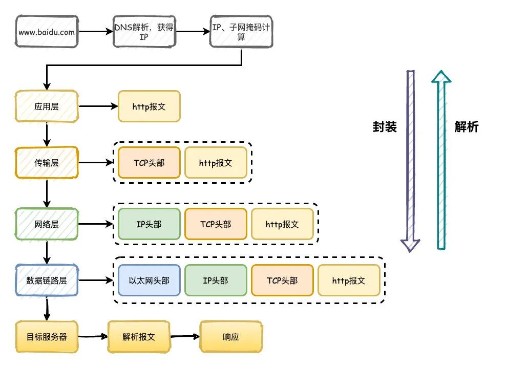


# OS

## 处理器

常见处理器有X86、ARM、MIPS、PowerPC四种。

### X86

X86架构是芯片巨头Intel设计制造的一种微处理器体系结构的统称。如果这样说你不理解，那么当我说出8086,80286等这样的词汇时，相信你肯定马上就理解了，正是基于此，X86架构这个名称被广为人知。

如今，我们所用的PC绝大部分都是X86架构。可见X86架构普及程度，这也和Intel的霸主地位密切相关。

x86采用CISC（Complex Instruction Set Computer，复杂指令集计算机）架构。与采用RISC不同的是，在CISC处理器中，程序的各条指令是按顺序串行执行的，每条指令中的各个操作也是按顺序串行执行的。顺序执行的优点是控制简单，但计算机各部分的利用率不高，执行速度慢。

- 优势
  - 速度快：单挑指令功能强大，指令数相对较少
  - 带宽要求低：还是因为指令数相对少，即使高频率运行也不需要很大的带宽往CPU传输指令
  - 由于X86采用CISC，因此指令均是按顺序串行执行的，每条指令中的各个操作也是按顺序串行执行的，而顺序执行的优点就是控制简单
  - 个人认为其最大的优势就是：产业化规模更大。目前觉大数据的CPU厂商（如AMD，Intel）生产的就是这种处理器
- 劣势
  - 通用寄存器组——X86指令集只有8个通用寄存器。所以，CISC的CPU执行是大多数时间是在访问存储器中的数据，而不是寄存器中的。这就是拖慢了整个系统的速度。而RISC系统往往具有非常多的通用寄存器，并采用了重叠寄存器窗口和寄存器堆等技术使寄存器资源得到充分的利用。
  - 解码——这是X86 CPU才有的东西。其作用是把长度不定的X86指令转换为长度固定的类似于RISC的指令，并交给RISC内核。解码分为硬件解码和微解码，对于简单的X86指令只要硬件解码即可，速度较快，而遇到复杂的X86指令则需要进行微解码，并把它分为若干条简单指令，速度较慢且很复杂
  - 寻址范围小——约束了用户需要
  - 计算机各部分的利用率不高，执行速度慢


### ARM

ARM是高级精简指令集的简称（Advanced RISC Machine），它是一个32位的精简指令集架构，但也配备16位指令集，一般来讲比等价32位代码节省达35%，却能保留32位系统的所有优势。

- 优势：
  - 体积小、低功耗、低成本、高性能——ARM被广泛应用在嵌入式系统中的最重要的原因
  - 支持Thumb（16位）/ARM（32位）双指令集，能很好的兼容8位/16位器件
  - 大量使用寄存器，指令执行速度更快
  - 大多数数据操作都在寄存器中完成
  - 寻址方式灵活简单，执行效率高
  - 流水线处理方式
  - 指令长度固定，大多数是简单指定且都能在一个时钟周期内完成，易于设计超标量与流水线
- 劣势
  - 性能差距稍大。ARM要在性能上接近X86，频率必须比X86处理器高很多，但是频率一高能耗就疯涨，抵消了ARM的优点


### MIPS

MIPS架构（英语：MIPS architecture，为Microprocessor without interlocked piped stages architecture的缩写，亦为Millions of Instructions Per Second的相关语），是一种采取精简指令集（RISC）的处理器架构，1981年出现，由MIPS科技公司开发并授权，广泛被使用在许多电子产品、网络设备、个人娱乐装置与商业装置上。最早的MIPS架构是32位，最新的版本已经变成64位。 它的基本特点是：

- 包含大量的寄存器、指令数和字符
- 可视的管道延时时隙

这些特性使MIPS架构能够提供最高的每平方毫米性能和当今SoC设计中最低的能耗。

- 优势
  - MIPS支持64bit指令和操作，ARM目前只到32bit
  - MIPS有专门的除法器，可以执行除法指令
  - MIPS的内核寄存器比ARM多一倍，所以同样的性能下MIPS的功耗会比ARM更低，同样功耗下性能比ARM更高
  - MIPS指令比ARM稍微多一点，稍微灵活一点
  - MIPS开放
- 劣势
  - MIPS的内存地址起始有问题，这导致了MIPS在内存和Cache的支持方面都有限制，现在的MIPS处理器单内核面对高容量内存时有问题
  - MIPS今后的发展方向时并行线程，类似INTEL的超线程，而ARM未来的发展方向时物理多核，目前看来物理多核占优
  - MIPS虽然结构更加简单，但是到现在还是顺序单发射，ARM已经进化到了乱序双发射


### PowerPC


## 内存管理

### 虚拟内存

单片机是没有操作系统的，所以每次写完代码，都需要借助工具把程序烧录进去，这样程序才能跑起来。另外，单片机的 CPU 是直接操作内存的「物理地址」。


在这种情况下，要想在内存中同时运行两个程序是不可能的。如果第一个程序在 2000 的位置写入一个新的值，将会擦掉第二个程序存放在相同位置上的所有内容，所以同时运行两个程序是根本行不通的，这两个程序会立刻崩溃。


**操作系统的解决方案**


**操作系统会提供一种机制，将不同进程的虚拟地址和不同内存的物理地址映射起来，然后为每个进程分配独立的一套虚拟地址。**如果程序要访问虚拟地址的时候，由操作系统转换成不同的物理地址，不同的进程运行的时候，写入的是不同的物理地址，这样就不会冲突了。于是，这里就引出了两种地址的概念：

- 我们程序所使用的内存地址叫做：**虚拟内存地址**（Virtual Memory Address）
- 实际存在硬件里面的空间地址叫：**物理内存地址**（Physical Memory Address）

操作系统引入了虚拟内存，进程持有的虚拟地址会通过 CPU 芯片中的内存管理单元（MMU）的映射关系，来转换变成物理地址，然后再通过物理地址访问内存，如下图所示：


操作系统管理虚拟地址与物理地址之间关系的方式：

- **内存分段**（比较早提出）
- **内存分页**


### 内存分段

程序是由若干个逻辑分段组成的，如可由代码分段、数据分段、栈段、堆段组成。**不同的段是有不同的属性的，所以就用分段（Segmentation）的形式把这些段分离出来。**


**① 分段机制中的虚拟地址和物理地址映射**

分段机制下的虚拟地址由两部分组成，**段选择因子**和**段内偏移量**。


- **段选择因子**就保存在段寄存器里面。段选择因子里面最重要的是**段号**，用作段表的索引。**段表**里面保存的是这个**段的基地址、段的界限和特权等级**等
- 虚拟地址中的**段内偏移量**应该位于 0 和段界限之间，如果段内偏移量是合法的，就将段基地址加上段内偏移量得到物理内存地址


**② 程序虚拟地址映射**

在上面，知道了虚拟地址是通过**段表**与物理地址进行映射的，分段机制会把程序的虚拟地址分成 4 个段，每个段在段表中有一个项，在这一项找到段的基地址，再加上偏移量，于是就能找到物理内存中的地址，如下图：

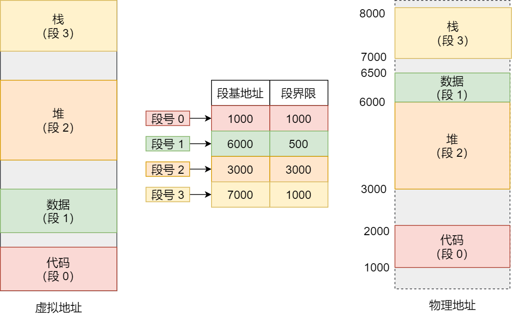

如果要访问段 3 中偏移量 500 的虚拟地址，我们可以计算出物理地址为，段 3 基地址 7000 + 偏移量 500 = 7500。分段的办法很好，解决了程序本身不需要关心具体的物理内存地址的问题，但它也有一些不足之处：

- **产生内存碎片**
- **内存交换效率低**


**③ 内存碎片**

内存碎片主要有两类问题：

- 外部内存碎片：产生了多个不连续的小物理内存，导致新的程序无法被装载。
- 内部内存碎片：程序所有内存都被装载到物理内存，但程序有部分的内存可能并不是很常使用，这也会导致内存浪费

**解决方案**

- 解决外部内存碎片的问题就是：**内存交换**。先把占用内存的程序写到硬盘中，然后再从硬盘读到内存中（装在位置已变）


**④ 内存交换效率低**

对于多进程的系统来说，用分段的方式，内存碎片是很容易产生的，产生了内存碎片，那不得不重新 `Swap` 内存区域，这个过程会产生性能瓶颈。因为硬盘的访问速度要比内存慢太多了，每一次内存交换，我们都需要把一大段连续的内存数据写到硬盘上。所以，**如果内存交换的时候，交换的是一个占内存空间很大的程序，这样整个机器都会显得卡顿。**


为了解决**内存分段**的**内存碎片**和**内存交换效率低**的问题，就出现了**内存分页**。


### 内存分页

分段的好处就是能产生连续的内存空间，但是会出现内存碎片和内存交换的空间太大的问题。要解决这些问题，那么就要想出能少出现一些内存碎片的办法。另外，当需要进行内存交换的时候，让需要交换写入或者从磁盘装载的数据更少一点，这样就可以解决问题了。这个办法，也就是**内存分页**（Paging）。


**① 内存分页（Paging）**

**分页是把整个虚拟和物理内存空间切成一段段固定尺寸的大小**。这样一个连续并且尺寸固定的内存空间，我们叫**页**（`Page`）。在 Linux 下，每一页的大小为 `4KB`。虚拟地址与物理地址之间通过**页表**来映射，如下图：

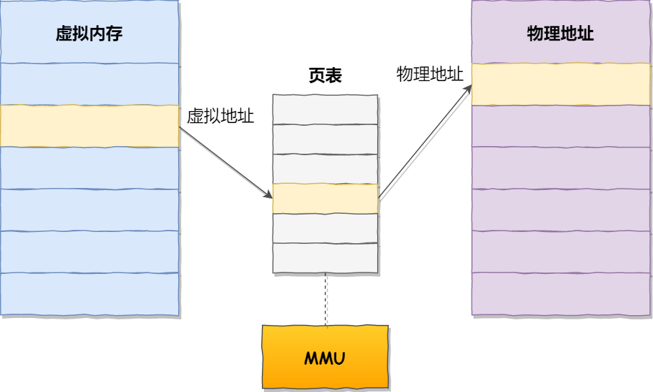

页表实际上存储在 CPU 的**内存管理单元** （MMU） 中，于是 CPU 就可以直接通过 MMU，找出要实际要访问的物理内存地址。而当进程访问的虚拟地址在页表中查不到时，系统会产生一个**缺页异常**，进入系统内核空间分配物理内存、更新进程页表，最后再返回用户空间，恢复进程的运行。


**② 分页解决分段问题**

由于内存空间都是预先划分好的，也就不会像分段会产生间隙非常小的内存，这正是分段会产生内存碎片的原因。而**采用了分页，那么释放的内存都是以页为单位释放的，也就不会产生无法给进程使用的小内存。**

如果内存空间不够，操作系统会把其他正在运行的进程中的「最近没被使用」的内存页面给释放掉，也就是暂时写在硬盘上，称为**换出**（Swap Out）。一旦需要的时候，再加载进来，称为**换入**（Swap In）。所以，一次性写入磁盘的也只有少数的一个页或者几个页，不会花太多时间，**内存交换的效率就相对比较高。**


更进一步地，分页的方式使得我们在加载程序的时候，不再需要一次性都把程序加载到物理内存中。我们完全可以在进行虚拟内存和物理内存的页之间的映射之后，并不真的把页加载到物理内存里，而是**只有在程序运行中，需要用到对应虚拟内存页里面的指令和数据时，再加载到物理内存里面去。**


**③ 分页机制中虚拟地址和物理地址的映射**

在分页机制下，虚拟地址分为两部分，**页号**和**页内偏移**。页号作为页表的索引，**页表**包含物理页每页所在**物理内存的基地址**，这个基地址与页内偏移的组合就形成了物理内存地址，见下图：


总结一下，对于一个内存地址转换，其实就是这样三个步骤：

- 把虚拟内存地址，切分成页号和偏移量
- 根据页号，从页表里面，查询对应的物理页号
- 直接拿物理页号，加上前面的偏移量，就得到了物理内存地址


**④ 简单分页缺陷**

有空间上的缺陷。因为操作系统是可以同时运行非常多的进程的，那这不就意味着页表会非常的庞大。

在 32 位的环境下，每个进程的虚拟地址空间共有 4GB，假设一个页的大小是 4KB（2^12），那么就需要大约 100 万 （2^20） 个页，每个「页表项」需要 4 个字节大小来存储，那么整个 4GB 空间的映射就需要有 `4MB` 的内存来存储页表。

这 4MB 大小的页表，看起来也不是很大。但是要知道每个进程都是有自己的虚拟地址空间的，也就说都有自己的页表。

那么，`100` 个进程的话，就需要 `400MB` 的内存来存储页表，这是非常大的内存了，更别说 64 位的环境了。


**⑤ 多级页表**

要解决上面的问题，就需要采用的是一种叫作**多级页表**（Multi-Level Page Table）的解决方案。

把这个 100 多万个「页表项」的单级页表再分页，将页表（一级页表）分为 `1024` 个页表（二级页表），每个表（二级页表）中包含 `1024` 个「页表项」，形成**二级分页**。如下图所示：

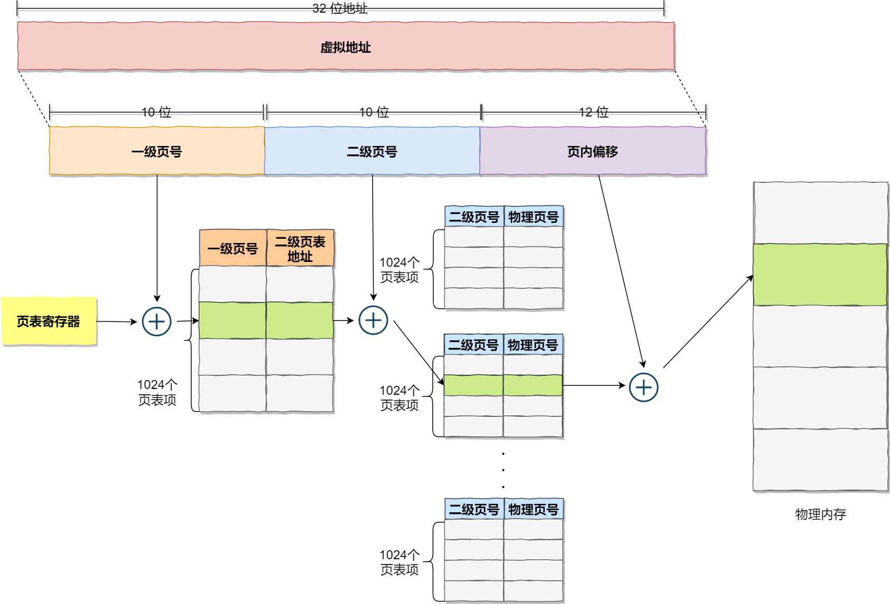

如果使用了二级分页，一级页表就可以覆盖整个 4GB 虚拟地址空间，但**如果某个一级页表的页表项没有被用到，也就不需要创建这个页表项对应的二级页表了，即可以在需要时才创建二级页表**。做个简单的计算，假设只有 20% 的一级页表项被用到了，那么页表占用的内存空间就只有 4KB（一级页表） + 20% * 4MB（二级页表）= `0.804MB`，这对比单级页表的 `4MB` 是不是一个巨大的节约？

那么为什么不分级的页表就做不到这样节约内存呢？我们从页表的性质来看，保存在内存中的页表承担的职责是将虚拟地址翻译成物理地址。假如虚拟地址在页表中找不到对应的页表项，计算机系统就不能工作了。所以**页表一定要覆盖全部虚拟地址空间，不分级的页表就需要有 100 多万个页表项来映射，而二级分页则只需要 1024 个页表项**（此时一级页表覆盖到了全部虚拟地址空间，二级页表在需要时创建）。我们把二级分页再推广到多级页表，就会发现页表占用的内存空间更少了，这一切都要归功于对局部性原理的充分应用。

对于 64 位的系统，两级分页肯定不够了，就变成了四级目录，分别是：

- 全局页目录项 PGD（Page Global Directory）
- 上层页目录项 PUD（Page Upper Directory）
- 中间页目录项 PMD（Page Middle Directory）
- 页表项 PTE（Page Table Entry）


**⑥ TLB**

多级页表虽然解决了空间上的问题，但是虚拟地址到物理地址的转换就多了几道转换的工序，这显然就降低了这俩地址转换的速度，也就是带来了时间上的开销。程序是有局部性的，即在一段时间内，整个程序的执行仅限于程序中的某一部分。相应地，执行所访问的存储空间也局限于某个内存区域。

我们就可以利用这一特性，把最常访问的几个页表项存储到访问速度更快的硬件，于是计算机科学家们，就在 CPU 芯片中，加入了一个专门存放程序最常访问的页表项的 Cache，这个 Cache 就是 TLB（Translation Lookaside Buffer） ，通常称为页表缓存、转址旁路缓存、快表等。

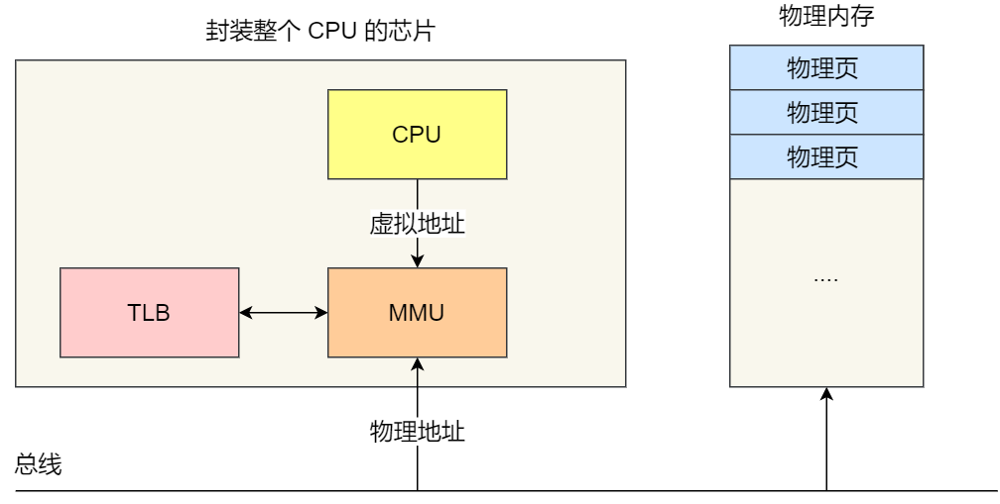

在 CPU 芯片里面，封装了内存管理单元（Memory Management Uni）芯片，它用来完成地址转换和 TLB 的访问与交互。有了 TLB 后，那么 CPU 在寻址时，会先查 TLB，如果没找到，才会继续查常规的页表。TLB 的命中率其实是很高的，因为程序最常访问的页就那么几个。


### 段页式内存管理

内存分段和内存分页并不是对立的，是可以组合起来在同一个系统中使用的，那么组合起来后，通常称为**段页式内存管理**。


段页式内存管理实现的方式：

- 先将程序划分为多个有逻辑意义的段，也就是前面提到的分段机制
- 接着再把每个段划分为多个页，也就是对分段划分出来的连续空间，再划分固定大小的页

这样地址结构就由**段号、段内页号和页内位移**三部分组成。用于段页式地址变换的数据结构是每一个程序一张段表，每个段又建立一张页表，段表中的地址是页表的起始地址，而页表中的地址则为某页的物理页号，如图所示：

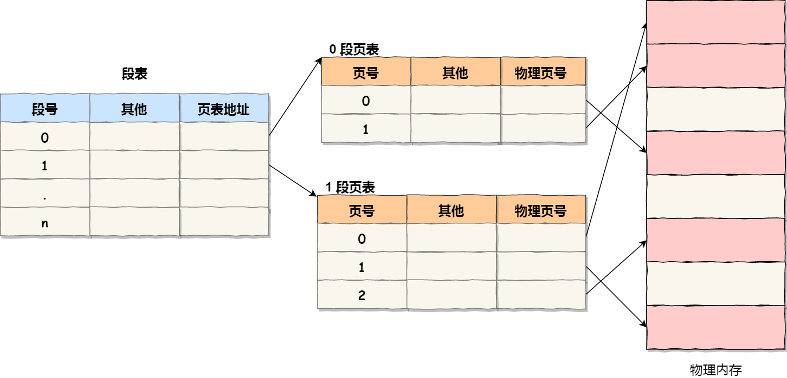

段页式地址变换中要得到物理地址须经过三次内存访问：

- 第一次访问段表，得到页表起始地址
- 第二次访问页表，得到物理页号
- 第三次将物理页号与页内位移组合，得到物理地址

可用软、硬件相结合的方法实现段页式地址变换，这样虽然增加了硬件成本和系统开销，但提高了内存的利用率。


### Linux 内存管理

**① Intel处理器的发展历史**

早期 Intel 的处理器从 80286 开始使用的是段式内存管理。但是很快发现，光有段式内存管理而没有页式内存管理是不够的，这会使它的 X86 系列会失去市场的竞争力。因此，在不久以后的 80386 中就实现了对页式内存管理。也就是说，80386 除了完成并完善从 80286 开始的段式内存管理的同时，还实现了页式内存管理。

但是这个 80386 的页式内存管理设计时，没有绕开段式内存管理，而是建立在段式内存管理的基础上，这就意味着，**页式内存管理的作用是在由段式内存管理所映射而成的地址上再加上一层地址映射。**

由于此时由段式内存管理映射而成的地址不再是“物理地址”了，Intel 就称之为“线性地址”（也称虚拟地址）。于是，段式内存管理先将逻辑地址映射成线性地址，然后再由页式内存管理将线性地址映射成物理地址。


- **逻辑地址**：程序所使用的地址，通常是没被段式内存管理映射的地址。即段式内存管理转换前的地址
- **线性地址**：也叫**虚拟地址**，通过段式内存管理映射的地址。页式内存管理转换前的地址


**② Linux管理内存**

**Linux 系统主要采用了分页管理，但是由于 Intel 处理器的发展史，Linux 系统无法避免分段管理**。于是 Linux 就把所有段的基地址设为 `0`，每个段都是从 0 地址开始的整个 4GB 虚拟空间（32 位环境下），也就意味着所有程序的地址空间都是线性地址空间（虚拟地址），相当于屏蔽了 CPU 逻辑地址的概念，所以段只被用于访问控制和内存保护。


**③ Linux的虚拟地址空间分布**

在 Linux 操作系统中，虚拟地址空间的内部又被分为**内核空间和用户空间**两部分，不同位数的系统，地址空间的范围也不同。比如最常见的 32 位和 64 位系统，如下所示：


- `32` 位系统的内核空间占用 `1G`，位于最高处，剩下的 `3G` 是用户空间
- `64` 位系统的内核空间和用户空间都是 `128T`，分别占据整个内存空间的最高和最低处，剩下的中间部分是未定义的


**④ 内核空间与用户空间**

- 进程在用户态时，只能访问用户空间内存
- 只有进入内核态后，才可以访问内核空间的内存；

虽然每个进程都各自有独立的虚拟内存，但是**每个虚拟内存中的内核地址，其实关联的都是相同的物理内存**。这样，进程切换到内核态后，就可以很方便地访问内核空间内存。


**⑤ 32位操作系统中的用户空间分布**

用户空间内存，从**低到高**分别是 7 种不同的内存段：

- 程序文件段，包括二进制可执行代码
- 已初始化数据段，包括静态常量
- 未初始化数据段，包括未初始化的静态变量
- 堆段，包括动态分配的内存，从低地址开始向上增长
- 文件映射段，包括动态库、共享内存等，从低地址开始向上增长（跟硬件和内核版本有关）
- 栈段，包括局部变量和函数调用的上下文等。栈的大小是固定的，一般是 `8 MB`。当然系统也提供了参数，以便我们自定义大小


在这 7 个内存段中，堆和文件映射段的内存是动态分配的。比如说，使用 C 标准库的 `malloc()` 或者 `mmap()` ，就可以分别在堆和文件映射段动态分配内存。


## 进程和线程

### 进程

#### 单进程创建的线程数

**一个进程最多可以创建多少个线程？**这个问题跟两个东西有关系：

- **进程的虚拟内存空间上限**。因为创建一个线程，操作系统需要为其分配一个栈空间，如果线程数量越多，所需的栈空间就要越大，那么虚拟内存就会占用的越多
- **系统参数限制**。虽然 Linux 并没有内核参数来控制单个进程创建的最大线程个数，但是有系统级别的参数来控制整个系统的最大线程个数

**结论**

- 32 位系统：用户态的虚拟空间只有 3G，如果创建线程时分配的栈空间是 10M，那么一个进程最多只能创建 300 个左右的线程
- 64 位系统：用户态的虚拟空间大到有 128T，理论上不会受虚拟内存大小的限制，而会受系统的参数或性能限制


**① 在进程里创建一个线程需要消耗多少虚拟内存大小？**

我们可以执行 ulimit -a 这条命令，查看进程创建线程时默认分配的栈空间大小，比如我这台服务器默认分配给线程的栈空间大小为 8M。


**② 32位Linux系统**

一个进程的虚拟空间是 4G，内核分走了1G，**留给用户用的只有 3G**。那么假设创建一个线程需要占用 10M 虚拟内存，总共有 3G 虚拟内存可以使用。于是可以算出，最多可以创建差不多 300 个（3G/10M）左右的线程。


如果想使得进程创建上千个线程，那么我们可以调整创建线程时分配的栈空间大小，比如调整为 512k：

```shell
$ ulimit -s 512
```


**③ 64位Linux系统**

测试服务器的配置：64位系统、2G 物理内存、单核 CPU。

64 位系统意味着用户空间的虚拟内存最大值是 128T，这个数值是很大的，如果按创建一个线程需占用 10M 栈空间的情况来算，那么理论上可以创建 128T/10M 个线程，也就是 1000多万个线程，有点魔幻。所以按 64 位系统的虚拟内存大小，理论上可以创建无数个线程。事实上，肯定创建不了那么多线程，除了虚拟内存的限制，还有系统的限制。

比如下面这三个内核参数的大小，都会影响创建线程的上限：

- `/proc/sys/kernel/threads-max`：表示系统支持的最大线程数，默认值是 `14553`
- `/proc/sys/kernel/pid_max`：表示系统全局的 PID 号数值的限制，每一个进程或线程都有 ID，ID 的值超过这个数，进程或线程就会创建失败，默认值是 `32768`
- `/proc/sys/vm/max_map_count`：表示限制一个进程可以拥有的VMA(虚拟内存区域)的数量，具体什么意思我也没搞清楚，反正如果它的值很小，也会导致创建线程失败，默认值是 `65530`

在这台服务器跑了前面的程序，其结果如下：

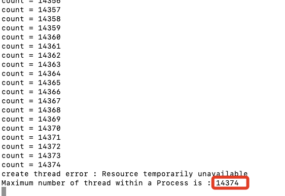

可以看到，创建了 14374 个线程后，就无法在创建了，而且报错是因为资源的限制。前面我提到的 `threads-max` 内核参数，它是限制系统里最大线程数，默认值是 14553。我们可以运行那个测试线程数的程序后，看下当前系统的线程数是多少，可以通过 `top -H` 查看。


左上角的 Threads 的数量显示是 14553，与 `threads-max` 内核参数的值相同，所以我们可以认为是因为这个参数导致无法继续创建线程。那么，我们可以把 threads-max 参数设置成 `99999`:

```shell
echo 99999 > /proc/sys/kernel/threads-max
```

设置完 threads-max 参数后，我们重新跑测试线程数的程序，运行后结果如下图：


可以看到，当进程创建了 32326 个线程后，就无法继续创建里，且报错是无法继续申请内存。此时的上限个数很接近 `pid_max` 内核参数的默认值（32768），那么我们可以尝试将这个参数设置为 99999：

```shell
echo 99999 > /proc/sys/kernel/pid_max
```

设置完 pid_max 参数后，继续跑测试线程数的程序，运行后结果创建线程的个数还是一样卡在了 32768 了。经过查阅资料发现，`max_map_count` 这个内核参数也是需要调大的，但是它的数值与最大线程数之间有什么关系，我也不太明白，只是知道它的值是会限制创建线程个数的上限。然后，我把 max_map_count 内核参数也设置成后 99999：

```shell
echo 99999 > /proc/sys/kernel/pid_max 
```

继续跑测试线程数的程序，结果如下图：

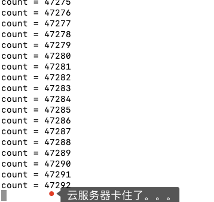

当创建差不多 5 万个线程后，我的服务器就卡住不动了，CPU 都已经被占满了，毕竟这个是单核 CPU，所以现在是 CPU 的瓶颈了。

接下来，我们换个思路测试下，把创建线程时分配的栈空间调大，比如调大为 100M，在大就会创建线程失败。

```shell
ulimit -s 1024000
```

设置完后，跑测试线程的程序，其结果如下：

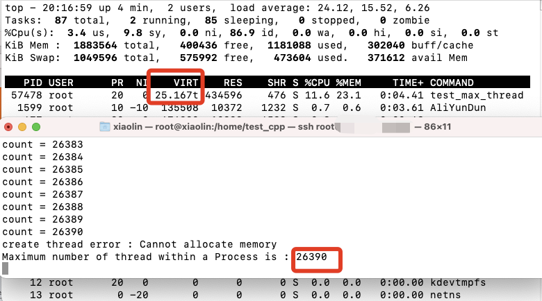

总共创建了 26390 个线程，然后就无法继续创建了，而且该进程的虚拟内存空间已经高达 25T，要知道这台服务器的物理内存才 2G。为什么物理内存只有 2G，进程的虚拟内存却可以使用 25T 呢？因为虚拟内存并不是全部都映射到物理内存的，程序是有**局部性的特性**，也就是某一个时间只会执行部分代码，所以只需要映射这部分程序就好。

你可以从上面那个 top 的截图看到，虽然进程虚拟空间很大，但是物理内存（RES）只有使用了 400M+。


### 线程
