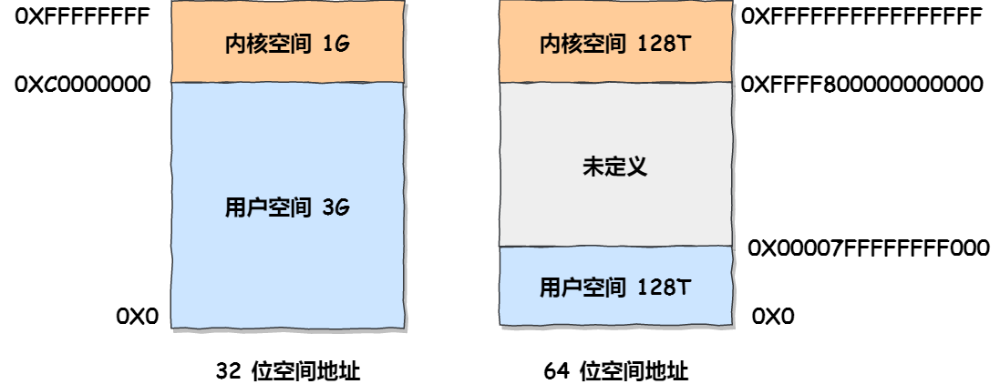
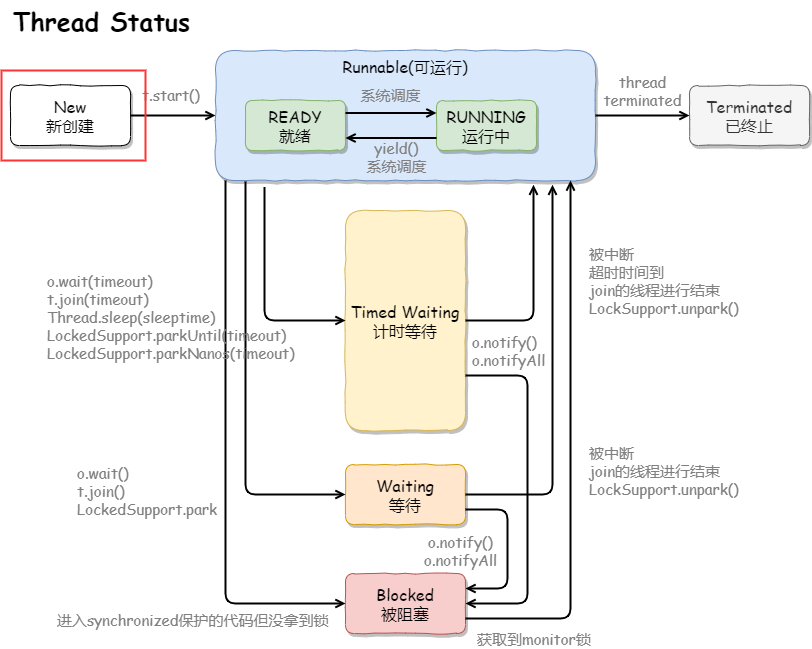
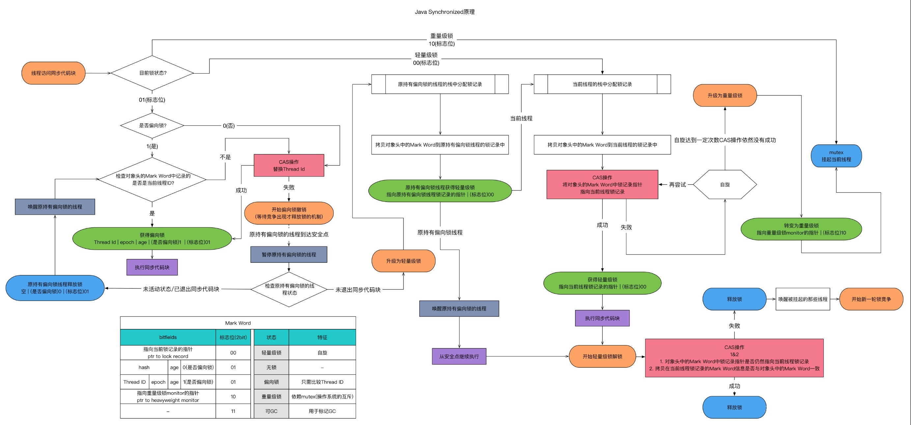
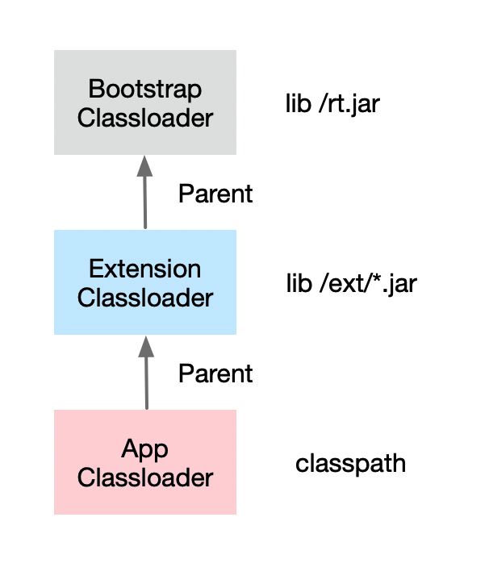
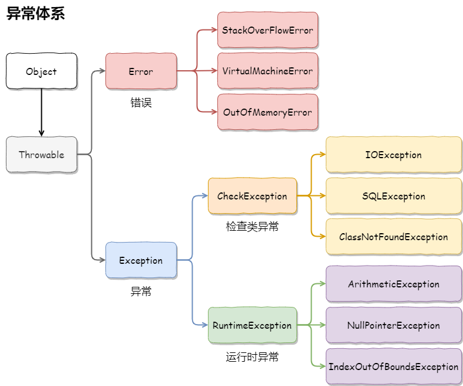
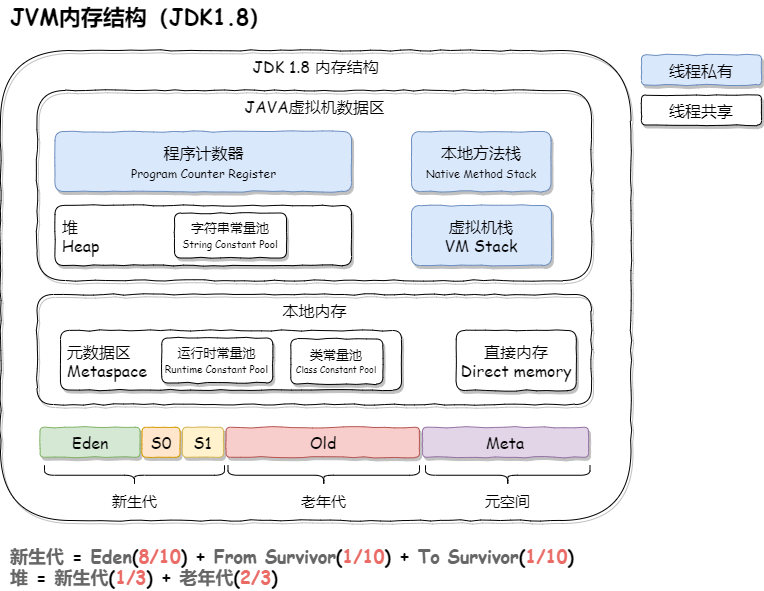

# lemon-guide

收纳了 `操作系统`、`JAVA`、`算法`、`数据库`、`中间件`、`解决方案`、`架构`、`DevOps` 和 `大数据` 等技术栈总结！其内容有来源笔者个人总结的内容，也有来源于互联网各种经典场景或案例的总结，目的在于把常用的技术内容进行归纳整理记录。

# [1 OS](OS.md)

## 1.1 TCP

收纳了网络模型、TCP三次握手、TCP四次挥手、TCP优化、常见TCP问题、Socket和TCP主要源码等知识点。

## 1.2 HTTP

收纳了HTTP缓存流程、强制缓存、协商缓存、请求流程、常见请求/响应头参数、状态码、请求方法等知识点。

## 1.3 OS

收纳了常见处理器介绍、虚拟内存、内存分段、内存分页、内存管理、进程和线程等知识点。

# [2 JAVA](JAVA.md)

## 2.1 J.U.C

收纳整理了Unsafe、LockSupport、CAS机制、AQS框架、Condition、volatile、lambda、Striped64、LongAdder、Semaphore、CyclicBarrier、CountDownLatch、CompletableFuture等知识点。

## 2.2 集合

收纳整理了List（ArrayList、LinkedList、Vector、CopyOnWriteArrayList）、Set（HashSet、TreeSet、LinkHashSet、ConcurrentSkipListSet、CopyOnWriteArraySet、ConcurrentSkipListSet）、Map（HashMap、TreeMap、HashTable、LinkHashMap、ConcurrentHashMap、ConcurrentSkipListMap）等知识点。

## 2.3 Queue

收纳整理了BlockingQueue（ArrayBlockingQueue、LinkedBlockingQueue、PriorityBlockingQueue、SynchronousQueue、DelayQueue）、BlockingDeque（LinkedBlockingDeque）、TransferQueue（LinkedTransferQueue）等知识点。

## 2.4 Thread

收纳整理了线程实现方式、四种创建方式、生命周期、四种JDK线程池、常用线程方法、线程安全、线程同步、多线程通信、线程协作、线程死锁、守护线程、ThreadLocal、ThreadPoolExecutor等知识点。

## 2.5 Lock

收纳整理了synchronized、ReentrantLock、ReentrantReadWriteLock、锁状态、自旋锁(SpinLock)、乐观锁/悲观锁、公平锁/非公平锁、可重入锁/不可重入锁、独占锁/共享锁、互斥锁/读写锁、锁优化（状态升级、自旋锁、所消除、锁粗化、分段锁、锁细化）等知识点。

## 2.6 I/O

收纳整理了阻塞/非阻塞IO、同步/异步IO、三种Reactor模式、Proactor模式、select/poll/epoll、BIO(同步阻塞I/O)、NIO(同步非阻塞I/O)、IO多路复用(异步阻塞I/O)、AIO(异步非阻塞I/O)、信号驱动式I/O等知识点。

## 2.7 Classloader

收纳整理了JVM类加载机制、类加载器、双亲委派等知识点。

## 2.8 Throwable

收纳整理了Error、Exception、异常处理方式等知识点。

## 2.9 JVM

收纳整理了JVM常量池、JVM内存布局、JAVA内存模型(JMM)、JVM运行时内存、引用级别、OOM场景等知识点。

## 2.10 GC

收纳整理了2种寻找垃圾算法、4种清理垃圾算法、9种GC垃圾收集器、GC日志格式、GC最佳实践、FullGC场景、CMSGC场景等知识点。

# [3 Algorithm](Algorithm.md)

## 3.1 数据结构

收纳整理了常用数据结构数组(Array)、链表(Linked List)、栈(Stack)、队列(Queue)、双端队列（Deque）、树(Tree)，和高级数据结构优先队列（Priority Queue）、图（Graph）、前缀树（Trie）、线段树（Segment Tree）、树状数组（Fenwick Tree）、散列表(Hash)、二叉堆等知识点。

## 3.2 算法

收纳整理了算法复杂度、4种算法思想，常用查找算法顺序查找、二分查找、插值查找、斐波那契查找，搜索算法深度优先搜索(DFS)、广度优先搜索(BFS)、迪杰斯特拉算法(Dijkstra)、kruskal(克鲁斯卡尔)算法，排序算法冒泡排序（Bubble Sort）、选择排序（Selection Sort）、插入排序（Insertion Sort）、希尔排序（Shell Sort）、归并排序（Merging Sort）、快速排序（Quick Sort）、基数排序（Radix Sort）、堆排序（Heap Sort）、计数排序（Counting Sort）、桶排序（Bucket Sort）等知识点。

## 3.3 设计模式

收纳整理了25种设计模式：简单工厂模式、工厂模式-Factory、抽象工厂模式-Abstract Factory、单例模式-Singleton、建造者模式-Builder、原型模式-Prototype、适配器模式-Adapter、组合模式-Composite、代理模式-Proxy、享元模式-Flywight、门面模式-Facade、桥梁模式-Bridge、修饰模式-Decorator、过滤器模式-Filter、模板方法模式-Template Method、解释器模式-Mediator、责任链模式-Chain of Responsibility、观察者模式-Observer、策略模式-Strategy、命令模式-Command、状态模式-State、访客模式-Visitor、转义模式-Interpreter、迭代器模式-Iterator、备忘录模式-Memento等知识点。

# [4 Database](Database.md)

收纳整理了、、、、、、、、等知识点。

# [5 Middleware](Middleware.md)

收纳整理了、、、、、、、、等知识点。

# [6 Solution](Solution.md)

收纳整理了、、、、、、、、等知识点。

# [7 Architecture](Architecture.md)

收纳整理了、、、、、、、、等知识点。

# [8 DevOps](DevOps.md)

本章节主要总结并收纳了常用的JDK工具、Linux命令、Shell语法、Git命令、测试工具、Docker等。

## 8.1 JDK Tools

- **jps**：用于查看JAVA进程编号
- **jstat**：用于打印GC回收统计信息，便于分析是否出现FGC等情况
- **jstack**：用于dump出指定进程中的线程堆栈快照信息，便于排查应用是否有锁、死锁或排查CPU占比高的线程代码
- **jmap**：用于dump出指定进程中当前内存的快照信息，便于分析内存的内容结构，从而定位内存泄漏等问题
- **jhat**：用于与jmap搭配使用，用来分析jmap生成的dump
- **jconsole**：Java GUI监视工具，可以以图表化的形式显示各种数据，并可通过远程连接监视远程的服务器VM
- **jvisualvm**：一个基于图形化界面的，可以查看本地及远程的JAVA GUI监控工具，可以查看CPU、堆、线程、GC等
- **jmc**：JDK自带图形界面监控工具。JMC打开性能日志后可查看**一般信息、内存、代码、线程、I/O、系统、事件** 功能
- **EclipseMAT**：基于Eclipse内存分析工具，它可以帮助我们查找内存泄漏和减少内存消耗

## 8.2 Linux Command

- **基本命令**：`vi/vim`、`scp`、`tar`、`su`、`df`、`tail`、`grep`、`awk`、`find`、`netstat`、`echo`、`telnet`、`rpm`、`yum`等
- **监控命令**
  - **Memory**：`free`、`vmstat`
  - **CPU**：`top`、`htop`、`sar`
  - **IO**：`iostat`、`pidsta`、`iotop`
  - **Network**：`netstat`、`iftop`、`tcpdump`
  - **Others**：`dstat`、`saidar`、`Glances`
- **瓶颈排查**：定位线上最耗CPU的线程、定位丢包错包情况、查看网络错误、包的重传率等

## 8.3 Shell

收纳了Shell脚本的变量、数组、算术运算、字符串、条件判断、流程控制等基本语法，学完后就可自己写Shell脚本。

## 8.4 Git

收纳了Git相关的常用命令，如：`git clone`、`git add`、`git rm`、`git commit`、`git branch`、`git tag`、`git push`、`git pull`、`git log`、`git remote`、`git fetch`、`git reset`等。

## 8.5 Test Tools

- **AB**：ApacheBench (ab)是 Apache 网站服务器软件附带的工具，专门用来做HTTP接口的性能测试
- **Jmeter**：Apache JMeter是Apache组织开发的基于Java的压力测试工具。用于对软件做压力测试

## 8.6 Docker

# [9 BigData](BigData.md)

收纳整理了、、、、、、、、等知识点。

# [10 Others](Others.md)

收纳整理了、、、、、、、、等知识点。

